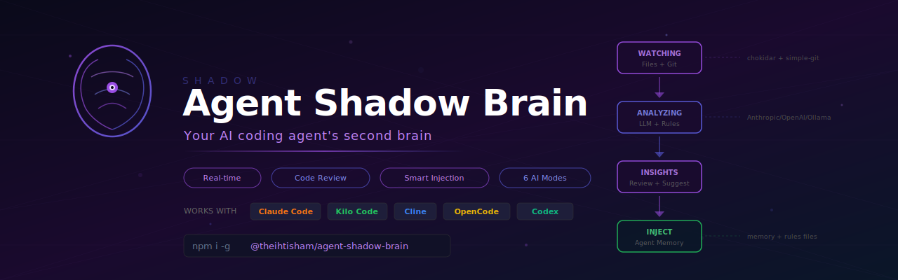
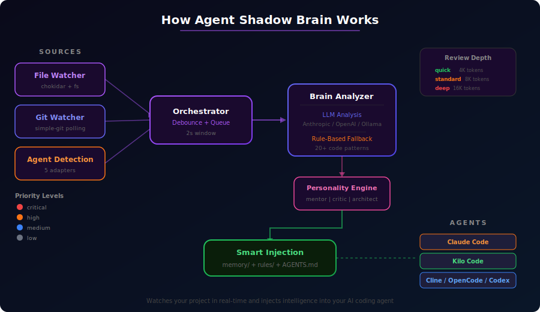
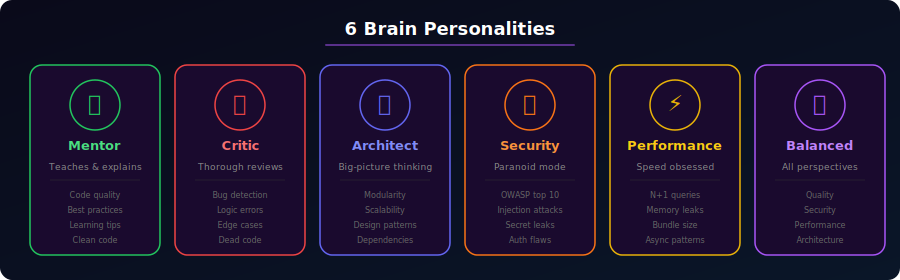

# Agent Shadow Brain

<div align="center">
  
</div>

<br/>

<div align="center">

[](https://www.npmjs.com/package/@theihtisham/agent-shadow-brain)
[](https://www.npmjs.com/package/@theihtisham/agent-shadow-brain)
[](https://github.com/theihtisham/agent-shadow-brain/blob/main/LICENSE)
[](https://www.npmjs.com/package/@theihtisham/agent-shadow-brain)

**A shadow AI brain that runs alongside your coding agent — watching, reviewing, and injecting intelligence in real-time.**

Works with **Claude Code** · **Kilo Code** · **Cline** · **OpenCode** · **Codex CLI** · and more

[Quick Start](#install) · [How It Works](#how-it-works) · [CLI Reference](#cli-reference) · [Personalities](#brain-personalities) · [API](#programmatic-api)

</div>

---

## Install

```bash
npm install -g @theihtisham/agent-shadow-brain
```

Or use directly without installing:

```bash
npx @theihtisham/agent-shadow-brain start .
```

### First-time setup

```bash
shadow-brain setup
```

Runs an interactive wizard to configure your LLM provider, personality, and review depth.

### Health check

```bash
shadow-brain doctor
```

Verifies your configuration, tests provider connectivity, and detects running agents.

---

## How It Works

<div align="center">
  
</div>

Shadow Brain watches your project files and git activity in real-time, reads what your coding agent is doing, and uses an LLM (with a smart rule-based fallback) to generate insights. It then injects those insights directly into the agent's memory files so the agent picks them up automatically.

**Pipeline:** `File/Git Watcher` → `Orchestrator (debounce)` → `Brain Analyzer (LLM + rules)` → `Personality Engine` → `Smart Injection into agent memory`

### Key Features

- **Real-time monitoring** — watches file changes and git activity as they happen
- **Multi-provider LLM** — supports Ollama (free/local), Anthropic, OpenAI, and OpenRouter
- **Smart fallback** — 20+ rule-based patterns work without any LLM (secrets detection, SQL injection, N+1 queries, and more)
- **6 brain personalities** — mentor, critic, architect, security, performance, or balanced
- **Auto-injection** — insights go directly into your agent's memory/rules files
- **5 agent adapters** — works with Claude Code, Kilo Code, Cline, OpenCode, and Codex
- **3 review depths** — quick (4K), standard (8K), deep (16K tokens)

---

## CLI Reference

### `shadow-brain start [project-dir]`

Start watching a project with a live terminal dashboard.

```bash
shadow-brain start .                          # Watch current directory
shadow-brain start . -p anthropic -k $API_KEY # Use Anthropic
shadow-brain start . --personality security   # Security-focused
shadow-brain start . --depth deep             # Deep analysis
shadow-brain start . --agents claude-code,codex  # Watch specific agents
```

| Option | Description |
|--------|-------------|
| `-p, --provider` | LLM provider: `anthropic`, `openai`, `ollama`, `openrouter` |
| `-m, --model` | LLM model name |
| `-k, --api-key` | API key |
| `--personality` | Brain personality (see below) |
| `--depth` | Review depth: `quick`, `standard`, `deep` |
| `--agents` | Comma-separated agent list |
| `--no-inject` | Disable auto-injection |

### `shadow-brain review [project-dir]`

One-shot project analysis without watch mode.

```bash
shadow-brain review .                  # Text output (default)
shadow-brain review . --output json    # JSON output
shadow-brain review . --output markdown # Markdown output
shadow-brain review . --depth deep     # Thorough analysis
```

### `shadow-brain inject <message>`

Manually inject a message into agent memory.

```bash
shadow-brain inject "Always use TypeScript strict mode"
shadow-brain inject "Check for SQL injection" --type warning --priority high
shadow-brain inject "Follow REST conventions" --agent claude-code
```

### `shadow-brain status`

Show current configuration and detected agents.

### `shadow-brain config`

Manage persistent configuration.

```bash
shadow-brain config --list
shadow-brain config provider openai
shadow-brain config apiKey sk-xxx
shadow-brain config personality architect
shadow-brain config --reset
```

### `shadow-brain setup`

Interactive setup wizard for first-time configuration.

### `shadow-brain doctor`

Health check — verifies config, tests provider connectivity, detects agents.

---

## Supported Agents

| Agent | Detection | Injection Target |
|-------|-----------|-----------------|
| **Claude Code** | `.claude/` directory, process | `.claude/memory/`, `.claude/rules/` |
| **Kilo Code** | VS Code extension data, `.kilocode/` | `.kilocode/rules/`, `.kilocode/memory/` |
| **Cline** | VS Code extension data, `.clinerules` | `.clinerules`, `.cline/memory/` |
| **OpenCode** | `.opencode/`, `opencode.json`, process | `.opencode/rules/`, `AGENTS.md` |
| **Codex CLI** | `.codex/`, `AGENTS.md`, process | `AGENTS.md` |

---

## Brain Personalities

<div align="center">
  
</div>

| Personality | Focus |
|------------|-------|
| `mentor` | Teaches and explains — code quality, best practices, learning tips |
| `critic` | Thorough code reviews — bugs, logic errors, edge cases, dead code |
| `architect` | Big-picture thinking — modularity, scalability, design patterns |
| `security` | Paranoid about vulnerabilities — OWASP top 10, injection attacks, secret leaks |
| `performance` | Optimization focused — N+1 queries, memory leaks, bundle size |
| `balanced` | Mix of all perspectives (default) |

---

## Rule-Based Detection Patterns

Even without an LLM configured, Shadow Brain detects **20+ code patterns**:

**Security:** hardcoded secrets, API keys, private keys, SQL injection, XSS (dangerouslySetInnerHTML), eval/Function usage, .env file changes, database credential exposure

**Code Quality:** large batch changes, deleted files, code changes without tests, missing .gitignore, missing tsconfig.json, framework mismatches, excessive console.log

**Performance:** N+1 query patterns, synchronous file I/O, async/await in loops

**Architecture:** multiple config file changes, database migrations, infrastructure/deployment files, API endpoint changes, lock file drift

---

## LLM Providers

| Provider | Setup | Cost |
|----------|-------|------|
| **Ollama** (default) | `ollama serve` + `ollama pull llama3` | Free, local |
| **Anthropic** | Set API key via `shadow-brain config apiKey sk-...` | Pay per token |
| **OpenAI** | Set provider + API key | Pay per token |
| **OpenRouter** | Set provider + API key | Pay per token |

---

## Programmatic API

```typescript
import { Orchestrator, createAdapter, LLMClient, Analyzer, PromptBuilder } from '@theihtisham/agent-shadow-brain';

const orchestrator = new Orchestrator({
  provider: 'ollama',
  projectDir: '/path/to/project',
  agents: ['claude-code'],
  watchMode: true,
  autoInject: true,
  reviewDepth: 'standard',
  brainPersonality: 'balanced',
});

orchestrator.on('insights', ({ insights }) => {
  console.log('Generated insights:', insights);
});

await orchestrator.start();
```

---

## Contributing

1. Fork the repository
2. Create your feature branch: `git checkout -b feature/my-feature`
3. Commit your changes: `git commit -m 'Add my feature'`
4. Push to the branch: `git push origin feature/my-feature`
5. Open a Pull Request

## License

[MIT](LICENSE) © 2025 theihtisham
