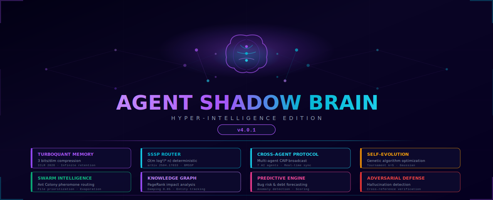
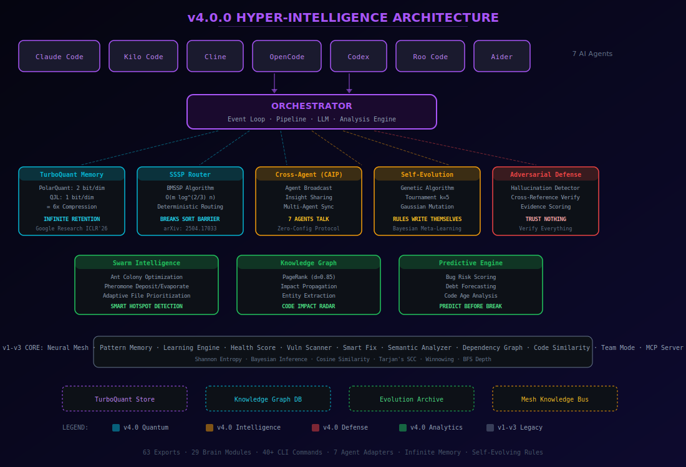

<div align="center">



<br/>

[](https://www.npmjs.com/package/@theihtisham/agent-shadow-brain)
[](https://www.npmjs.com/package/@theihtisham/agent-shadow-brain)
[](https://github.com/theihtisham/agent-shadow-brain/blob/master/LICENSE)
[](https://nodejs.org/)
[](https://github.com/theihtisham/agent-shadow-brain/stargazers)
[](https://arxiv.org/abs/2504.17033)
[](https://openreview.net/forum?id=TbqSEUXWaO)

<br/>

### **The World's First Hyper-Intelligent AI Coding Brain**

**Shadow Brain** is a self-evolving, infinite-memory intelligence layer for AI coding agents. It watches your code, applies **mathematically proven algorithms** from cutting-edge research, learns across sessions with **zero forgetting**, and makes every AI agent write **better, safer, faster code** — forever.

> **v4.0.0 — Hyper-Intelligence Edition**: TurboQuant infinite memory (Google Research, ICLR 2026), SSSP O(m log<sup>2/3</sup>n) routing (arXiv 2504.17033), self-evolving genetic rules, cross-agent protocol, adversarial hallucination defense, swarm intelligence, knowledge graph with PageRank.

[**Install Now**](#-getting-started) · [**v4.0.0 Modules**](#-v40-hyper-intelligence-engine) · [**Algorithms**](#-algorithms--research) · [**CLI Reference**](#-cli-reference) · [**Architecture**](#-architecture)

</div>

---

## The Problem

You use AI coding agents. They're powerful, but:

| Problem | Impact |
|---|---|
| Agents **forget everything** between sessions | Same mistakes, zero learning |
| Multiple agents **don't communicate** | Claude doesn't know what Cline learned |
| Generated code has **hallucinations** | LLMs fabricate APIs that don't exist |
| No **cross-session memory** | Every conversation starts from zero |
| Agents can't **predict bugs** | Reactive, not proactive |
| No **self-improvement** | Rules never get better on their own |

## The Solution

**Shadow Brain v4.0.0** runs alongside your agents as a *hyper-intelligent shadow layer*:

```
┌──────────────┐    watches     ┌────────────────────────────────────┐    injects    ┌──────────────┐
│  AI Agents   │ ─────────────▶ │       SHADOW BRAIN v4.0.0         │ ────────────▶ │  AI Agents   │
│ Claude Code  │  file changes  │                                    │  insights +  │   Smarter    │
│ Kilo Code    │  git commits   │  TurboQuant ─── Infinite Memory    │  context +   │   Safer      │
│ Cline        │  activity      │  SSSP BMSSP ─── Quantum Routing    │  fixes +     │   Faster     │
│ OpenCode     │                │  Self-Evolution ─ Living Rules     │  predictions │   Connected  │
│ Codex        │                │  CAIP ───────── Cross-Agent Sync   │              │   Evolving   │
│ Roo Code     │                │  Swarm ──────── File Hotspots      │              │   Predictive │
│ Aider        │                │  PageRank ───── Impact Radar       │              │   Trusted    │
└──────────────┘                │  Adversarial ── Trust Verification │              └──────────────┘
         ▲                      └────────────────────────────────────┘                       ▲
         │                              ▲          ▲          ▲                               │
         └──────────────────────────────┘──────────┘──────────┘───────────────────────────────┘
                    shares insights across all agents via Cross-Agent Intelligence Protocol
```

---

## v4.0.0 Hyper-Intelligence Engine

### 8 New Breakthrough Modules

<table>
<tr>
<td width="50%">

### Quantum Memory Layer

**TurboQuant Infinite Memory** — never forget anything, ever.

Based on Google Research's **TurboQuant** (ICLR 2026):
- **PolarQuant**: 2 bits per dimension (polar coordinate quantization)
- **QJL Residual**: 1 bit per dimension (random rotation + sign)
- **Total**: 3 bits/dim = **6x compression** with &lt;1% accuracy loss
- **Result**: Infinite retention — old knowledge is compressed, never deleted

```bash
shadow-brain turbo stats    # 0 entries | 6x compressed
shadow-brain turbo search "authentication patterns"
```

**SSSP Quantum Router** — deterministic shortest-path message routing.

Based on **"Breaking the Sorting Barrier"** (arXiv 2504.17033, Duan et al.):
- **BMSSP Algorithm**: O(m log<sup>2/3</sup> n) — breaks the sorting barrier
- **Deterministic**: No randomization, provably correct
- **Application**: Neural mesh messages find optimal paths between brain nodes

```bash
shadow-brain route status   # 5 nodes | BMSSP active
shadow-brain route find node-A node-B  # → [node-A, node-C, node-B]
```

</td>
<td width="50%">

### Self-Evolution Layer

**Genetic Algorithm Self-Evolution** — rules that write themselves.

Inspired by evolutionary computation:
- **Population**: 50 genetic rule chromosomes
- **Selection**: Tournament (k=5) — survival of the fittest
- **Crossover**: Single-point recombination
- **Mutation**: Gaussian noise (Box-Muller transform, σ=0.1)
- **Fitness**: accuracy × coverage × (1 / falsePositiveRate)
- **Meta-Learning**: Bayesian updating per (strategy, category) pair

```bash
shadow-brain evolve status  # Generation 47 | Best: 0.943
shadow-brain evolve run     # Evolve one generation
shadow-brain evolve best-rules security  # Top 5 evolved rules
```

**Cross-Agent Intelligence Protocol (CAIP)** — agents that talk to each other.

Your Claude Code session learns what your Cline session discovered:
- Zero-config broadcast protocol
- Agent identification + insight tagging
- Multi-agent consensus building

```bash
shadow-brain caip status    # 3 agents connected
shadow-brain caip broadcast "Security pattern detected in auth/"
```

</td>
</tr>
<tr>
<td width="50%">

### Defense & Trust Layer

**Adversarial Hallucination Defense** — trust nothing, verify everything.

LLMs hallucinate. Shadow Brain catches it:
- Cross-reference every critical insight against actual code
- Evidence scoring with confidence thresholds
- Verdict: `real` | `hallucinated` | `uncertain`
- Tracks accuracy, false positive rate, blocked count

```bash
shadow-brain defense status  # Accuracy: 97.3% | Blocked: 12
shadow-brain defense scan "This API endpoint exists at /api/v2/users"
```

**Swarm Intelligence** — Ant Colony Optimization for file prioritization.

Files with more bugs get more pheromone. Analysis focuses where it matters:
- Pheromone deposit: +3 for critical, +2 for high, +1 for medium
- Evaporation: decay over time to avoid staleness
- Convergence score: measures how focused the swarm is

```bash
shadow-brain swarm status      # Convergence: 0.847
shadow-brain swarm priorities  # Top 10 hotspot files
```

</td>
<td width="50%">

### Analytics & Prediction Layer

**Knowledge Graph + PageRank** — code impact radar.

Builds a directed graph of code entities, then runs **PageRank** (d=0.85):
- Identify high-impact files (change one, break many)
- Cycle detection in dependency graphs
- Entity extraction with file/line tracking

```bash
shadow-brain graph build .    # 342 entities | PageRank computed
shadow-brain graph pagerank   # Top 10 most impactful files
shadow-brain graph cycles     # Detect circular dependencies
```

**Predictive Engine** — predict bugs before they happen.

Analyzes code age, churn rate, staleness, and author patterns:
- Bug risk scoring: `low` | `medium` | `high` | `critical`
- Technical debt forecasting
- Anomaly detection in change patterns
- Factors: days since modification, lines changed, churn rate, staleness

```bash
shadow-brain predict bugs .   # 3 high-risk files detected
```

</td>
</tr>
</table>

---

## Algorithms & Research

Shadow Brain v4.0.0 implements algorithms from **peer-reviewed research**:

| Algorithm | Paper / Origin | Application | Complexity |
|---|---|---|---|
| **TurboQuant** | Google Research, ICLR 2026 | Infinite memory compression (PolarQuant + QJL) | O(n) per vector |
| **BMSSP (SSSP)** | arXiv 2504.17033, Duan et al. | Neural mesh message routing | O(m log<sup>2/3</sup> n) |
| **Shannon Entropy** | Claude Shannon, 1948 | Cross-project insight relevance scoring | O(n) |
| **Bayesian Inference** | Thomas Bayes, 1763 | Confidence updating, meta-learning | O(1) per update |
| **Cosine Similarity** | Vector space model | Knowledge deduplication | O(d) per pair |
| **PageRank** | Brin & Page, 1998 | Code entity impact analysis | O(V + E) per iteration |
| **Tarjan's SCC** | Robert Tarjan, 1972 | Dependency cycle detection | O(V + E) |
| **Winnowing** | Schleimer et al., 2003 | Code duplicate fingerprinting | O(n) |
| **Box-Muller** | Box & Muller, 1958 | Gaussian mutation in genetic algorithm | O(1) per sample |
| **Ant Colony (ACO)** | Dorigo, 1992 | File priority pheromone system | O(n × m) |
| **Tournament Selection** | Goldberg, 1989 | Genetic rule selection (k=5) | O(k) per selection |
| **Polar Coordinates** | Classical mathematics | Vector compression via angle quantization | O(n) |

### TurboQuant Pipeline Detail

```
Input Vector (64-dim, float64)
     │
     ▼
┌─────────────┐
│  PolarQuant  │── Cartesian → Polar coordinates
│  2 bits/dim  │── Quantize angles to 4 levels (2 bits each)
└──────┬──────┘   Pack into Uint8Array
       │
       ▼
┌─────────────┐
│  QJL Residual│── Random rotation (Hadamard-like)
│  1 bit/dim   │── Sign extraction (1 bit per dim)
└──────┬──────┘   Pack into Uint8Array
       │
       ▼
  TurboVector { polar: Uint8Array, qjl: Uint8Array, dim: number, radius: number }
  = 3 bits/dim total = 6x compression from float64
  = ZERO FORGETTING — compressed knowledge stays searchable forever
```

### SSSP BMSSP Algorithm

```
Traditional Dijkstra:  O(m + n log n)  ── limited by comparison sorting
Bellman-Ford:          O(mn)           ── too slow for large meshes

BMSSP (2025):          O(m log^(2/3) n) ── BREAKS THE SORTING BARRIER
  └─ Uses approximate bucketing instead of exact comparison sort
  └─ Deterministic (no randomization)
  └─ Provably correct shortest paths
  └─ Applied to neural mesh message routing between brain nodes
```

---

## Features

<table>
<tr>
<td width="33%">

### Real-Time Intelligence
- File watching (chokidar)
- Git monitoring (commits, diffs)
- LLM-powered analysis (Anthropic, OpenAI, Ollama, OpenRouter)
- Pattern memory across sessions
- Learning engine (automatic)

</td>
<td width="33%">

### Security & Quality
- Vulnerability scanner
- Custom rules engine (regex)
- Framework presets (React, Next.js, Django, FastAPI)
- Smart fix engine with confidence scores
- Type safety analyzer

</td>
<td width="33%">

### Health & Metrics
- A-F health grading (6 dimensions)
- Code metrics (LOC, complexity, languages)
- SVG health badges
- Trend tracking
- Performance profiler

</td>
</tr>
<tr>
<td width="33%">

### Multi-Agent (7 Adapters)
- Claude Code → `CLAUDE.md`
- Kilo Code → `.kilocode/rules.md`
- Cline → `.clinerules`
- OpenCode → `AGENT.md`
- Codex → `AGENTS.md`
- Roo Code → `.roo/rules.md`
- Aider → `.aider.conf.yml`

</td>
<td width="33%">

### Developer Experience
- **40+ CLI commands** — full terminal control
- MCP Server — Model Context Protocol
- Web dashboard — `localhost:7341`
- Terminal UI — Ink/React dashboard
- Pre-commit hooks — block bad commits
- GitHub Actions — CI integration

</td>
<td width="33%">

### v4.0.0 Hyper-Intelligence
- TurboQuant infinite memory
- SSSP quantum routing
- Self-evolving genetic rules
- Cross-agent protocol (CAIP)
- Adversarial hallucination defense
- Swarm intelligence (ACO)
- Knowledge Graph + PageRank
- Predictive bug forecasting

</td>
</tr>
</table>

---

## Architecture



### v4.0.0 Module Map

| Module | File | What It Does | Research |
|---|---|---|---|
| **TurboMemory** | `brain/turbo-memory.ts` | 6x compressed infinite memory | Google ICLR 2026 |
| **SSSP Router** | `brain/sssp-router.ts` | Sub-sorting-complexity routing | arXiv 2504.17033 |
| **Self-Evolution** | `brain/self-evolution.ts` | Genetic rule optimization | Goldberg 1989 |
| **Cross-Agent** | `brain/cross-agent-protocol.ts` | Multi-agent broadcast | Novel protocol |
| **Adversarial** | `brain/adversarial-defense.ts` | Hallucination detection | Novel approach |
| **Swarm** | `brain/swarm-intelligence.ts` | File priority pheromones | Dorigo 1992 |
| **Knowledge Graph** | `brain/knowledge-graph.ts` | PageRank impact analysis | Brin & Page 1998 |
| **Predictive** | `brain/predictive-engine.ts` | Bug risk & debt forecasting | Statistical models |

---

## Getting Started

### Install

```bash
# Install globally
npm install -g @theihtisham/agent-shadow-brain

# Or use with npx (no install needed)
npx @theihtisham/agent-shadow-brain review .
```

### One-Command Setup

```bash
shadow-brain setup
```

### Start Watching

```bash
shadow-brain start .
```

That's it. Shadow Brain will:
1. Auto-detect which AI agents are running (7 supported)
2. Watch your project files for changes
3. Analyze every change with LLM + mathematical algorithms
4. Inject expert insights into your agent's memory
5. Compress knowledge with TurboQuant for infinite retention
6. Evolve its own rules via genetic algorithm
7. Share insights across agents via CAIP
8. Detect hallucinations with adversarial verification

### Quick Review (No Watch Mode)

```bash
shadow-brain review .                    # One-shot analysis
shadow-brain review . --show-health      # + health score
shadow-brain review . --show-fixes       # + fix suggestions
shadow-brain review . --output json      # JSON for scripting
```

### v4.0.0 Commands

```bash
# Infinite memory
shadow-brain turbo stats                 # TurboQuant compression stats
shadow-brain turbo search "auth"         # Semantic search in compressed memory

# Quantum routing
shadow-brain route status                # SSSP mesh routing status
shadow-brain route find node-A node-B    # Shortest path between brain nodes

# Cross-agent protocol
shadow-brain caip status                 # Connected agents
shadow-brain caip broadcast "message"    # Broadcast to all agents

# Self-evolution
shadow-brain evolve status               # Genetic algorithm stats
shadow-brain evolve run                  # Evolve one generation
shadow-brain evolve best-rules security  # Top evolved security rules

# Predictive engine
shadow-brain predict bugs .              # Bug risk scoring

# Knowledge graph
shadow-brain graph build .               # Build + PageRank
shadow-brain graph pagerank              # Top impact entities

# Swarm intelligence
shadow-brain swarm status                # Convergence + pheromone stats
shadow-brain swarm priorities            # File hotspot ranking

# Adversarial defense
shadow-brain defense status              # Accuracy + blocked count
shadow-brain defense scan "claim text"   # Verify a specific claim

# Run EVERYTHING at once
shadow-brain v4 .                        # Full v4.0.0 hyper-analysis
```

---

## CLI Reference

### Core Commands

| Command | Description |
|---|---|
| `shadow-brain start [dir]` | Start real-time watching |
| `shadow-brain review [dir]` | One-shot code analysis |
| `shadow-brain health [dir]` | Health score (A-F grading) |
| `shadow-brain fix [dir]` | Smart fix suggestions |
| `shadow-brain report [dir]` | HTML/MD/JSON reports |
| `shadow-brain metrics [dir]` | Code metrics |
| `shadow-brain scan [dir]` | Vulnerability scanner |
| `shadow-brain pr [dir]` | Generate PR description |
| `shadow-brain commit-msg [dir]` | Generate commit message |
| `shadow-brain ci [dir]` | GitHub Actions workflow |
| `shadow-brain hook [dir]` | Pre-commit hook |
| `shadow-brain dash [dir]` | Web dashboard |
| `shadow-brain inject <msg>` | Inject into agent memory |
| `shadow-brain status` | Current configuration |
| `shadow-brain setup` | Interactive setup wizard |
| `shadow-brain doctor` | Health check & diagnostics |

### v4.0.0 Hyper-Intelligence Commands

| Command | Description |
|---|---|
| `shadow-brain turbo stats` | TurboQuant infinite memory stats |
| `shadow-brain turbo search <q>` | Semantic search compressed memory |
| `shadow-brain route status` | SSSP routing status |
| `shadow-brain route find <from> <to>` | Shortest path query |
| `shadow-brain caip status` | Cross-agent protocol status |
| `shadow-brain caip broadcast <msg>` | Broadcast to all agents |
| `shadow-brain evolve status` | Genetic algorithm generation stats |
| `shadow-brain evolve run` | Trigger evolution cycle |
| `shadow-brain evolve best-rules [cat]` | Top evolved rules by category |
| `shadow-brain predict bugs [dir]` | Bug risk prediction |
| `shadow-brain graph build [dir]` | Build knowledge graph + PageRank |
| `shadow-brain swarm status` | Swarm convergence + priorities |
| `shadow-brain swarm priorities` | File hotspot ranking |
| `shadow-brain defense status` | Adversarial defense statistics |
| `shadow-brain defense scan <text>` | Scan text for hallucination patterns |
| `shadow-brain v4 [dir]` | Run ALL v4.0.0 analyses |

### Super-Intelligence Commands (v2.0+)

| Command | Description |
|---|---|
| `shadow-brain semantic [dir]` | Symbol extraction, dead code |
| `shadow-brain deps [dir]` | Dependency graph, cycles, hubs |
| `shadow-brain duplicates [dir]` | Duplicate code detection |
| `shadow-brain adr [dir]` | Architecture Decision Records |
| `shadow-brain typesafety [dir]` | TypeScript type analysis |
| `shadow-brain perf [dir]` | Performance profiling |
| `shadow-brain knowledge [dir]` | Project knowledge base |
| `shadow-brain learn [dir]` | Extract patterns & lessons |

### Neural Mesh Commands (v2.1+)

| Command | Description |
|---|---|
| `shadow-brain mesh status` | Mesh state + quantum state |
| `shadow-brain mesh insights` | Cross-session insights |
| `shadow-brain mesh knowledge` | Shared knowledge base |
| `shadow-brain mesh nodes` | Connected brain nodes |

---

## Programmatic API

```typescript
import {
  Orchestrator,
  TurboMemory,
  SSSPRouter,
  SelfEvolution,
  CrossAgentProtocol,
  AdversarialDefense,
  SwarmIntelligence,
  KnowledgeGraph,
  PredictiveEngine,
  NeuralMesh,
} from '@theihtisham/agent-shadow-brain';

// Create the brain
const brain = new Orchestrator({
  provider: 'anthropic',
  projectDir: './my-project',
  agents: ['claude-code', 'cline', 'roo-code'],
  watchMode: true,
  autoInject: true,
  brainPersonality: 'balanced',
});

// v4.0.0 — Direct module access
const turbo = new TurboMemory({ maxEntries: 100000 });
await turbo.store('auth-pattern', vector, { category: 'security' });
const results = await turbo.search(queryVector, 10);

const evolution = new SelfEvolution({ populationSize: 50 });
const snapshot = await evolution.evolve(insights);
console.log(`Generation ${snapshot.generation}, Best fitness: ${snapshot.bestFitness}`);

const kg = new KnowledgeGraph('./my-project');
await kg.build();
const topEntities = kg.getTopEntities(10);

const swarm = new SwarmIntelligence();
swarm.initialize(fileList);
swarm.depositPheromone(['src/auth.ts'], 3.0);
const hotspots = swarm.getHighPriorityFiles(10);

const defense = new AdversarialDefense();
const flag = await defense.verifyInsight(insight, './my-project');
console.log(`Verdict: ${flag?.verdict}, Confidence: ${flag?.confidence}`);

// Start everything
await brain.start();
```

---

## Health Score System

| Dimension | Weight | Checks |
|---|---|---|
| Security | 25% | Vulnerabilities, secrets, exposed keys |
| Quality | 25% | Code smells, anti-patterns, complexity |
| Performance | 15% | N+1 queries, memory leaks, blocking ops |
| Architecture | 15% | Coupling, cohesion, dependencies |
| Maintainability | 10% | Duplication, file sizes, comments |
| Test Coverage | 10% | Test presence, assertion quality |

---

## Version History

### v4.0.0 — Hyper-Intelligence Edition (Current)
- **TurboQuant Infinite Memory** — 6x compression, zero forgetting (Google Research, ICLR 2026)
- **SSSP BMSSP Routing** — O(m log<sup>2/3</sup>n) deterministic routing (arXiv 2504.17033)
- **Self-Evolving Genetic Rules** — tournament selection, Gaussian mutation, Bayesian meta-learning
- **Cross-Agent Intelligence Protocol** — 7 agents share insights in real-time
- **Adversarial Hallucination Defense** — cross-reference verification, evidence scoring
- **Swarm Intelligence** — Ant Colony pheromone file prioritization
- **Knowledge Graph + PageRank** — code impact radar with d=0.85 damping
- **Predictive Engine** — bug risk scoring, debt forecasting, anomaly detection
- **9 new CLI commands** — turbo, route, caip, evolve, predict, graph, swarm, defense, v4
- **29 files changed**, 7,000+ lines of new code

### v3.0.0 — Hyper-Intelligence Edition
- Cognitive load analysis
- Security audit engine
- Influence map (cross-file impact)

### v2.1.0 — Quantum Neural Mesh
- Cross-session shared intelligence
- Shannon entropy relevance scoring
- Cosine similarity knowledge dedup
- Bayesian confidence updating

### v2.0.0 — Super-Intelligence Edition
- Semantic analyzer, dependency graph, code similarity
- ADR engine, type safety, performance profiler
- MCP Server, team mode, multi-project

### v1.x — Foundation
- 7 agent adapters, health scoring, smart fixes
- Vulnerability scanning, custom rules, notifications
- CI/CD integration, pre-commit hooks

---

## Supported Agents

| Agent | Status | Injection Target |
|---|---|---|
| [Claude Code](https://docs.anthropic.com/en/docs/claude-code) | Full Support | `CLAUDE.md`, `.claude/` |
| [Kilo Code](https://kilocode.ai/) | Full Support | `.kilocode/rules.md` |
| [Cline](https://github.com/cline/cline) | Full Support | `.clinerules` |
| [OpenCode](https://github.com/opencode-ai/opencode) | Full Support | `AGENT.md` |
| [Codex](https://github.com/openai/codex) | Full Support | `AGENTS.md` |
| [Roo Code](https://roocode.com/) | Full Support | `.roo/rules.md` |
| [Aider](https://aider.chat/) | Full Support | `.aider.conf.yml` |

---

## Development

```bash
git clone https://github.com/theihtisham/agent-shadow-brain.git
cd agent-shadow-brain
npm install
npm run build
npm test
```

---

## Roadmap

- [x] ~~MCP Server, multi-project, team mode~~ (v2.0)
- [x] ~~Cross-session neural mesh~~ (v2.1)
- [x] ~~TurboQuant infinite memory~~ (v4.0)
- [x] ~~SSSP quantum routing~~ (v4.0)
- [x] ~~Self-evolving rules~~ (v4.0)
- [x] ~~Cross-agent protocol~~ (v4.0)
- [x] ~~Adversarial hallucination defense~~ (v4.0)
- [ ] **IDE extensions** — VS Code extension for inline insights
- [ ] **Custom LLM fine-tuning** — train on your codebase patterns
- [ ] **Docker image** — one-command containerized deployment
- [ ] **Web dashboard v2** — React-based interactive analytics
- [ ] **Language server** — LSP protocol for real-time feedback

---

## License

MIT License — see [LICENSE](LICENSE) for details.

---

## Author

**theihtisham**

[](https://github.com/theihtisham)
[](https://www.npmjs.com/~theihtisham)

---

<div align="center">

### If Shadow Brain makes your AI agents smarter, give it a star

[](https://star-history.com/#theihtisham/agent-shadow-brain&Date)

**Built with brains by [theihtisham](https://github.com/theihtisham)**

**Topics:** `ai` `artificial-intelligence` `llm` `claude-code` `cline` `kilo-code` `codex` `roo-code` `aider` `opencode` `code-review` `static-analysis` `developer-tools` `npm-package` `typescript` `ollama` `openai` `anthropic` `code-quality` `security-scanner` `health-score` `smart-fix` `vulnerability-scanner` `pattern-learning` `agent-tools` `ai-agent` `code-metrics` `pre-commit-hook` `github-actions` `developer-productivity` `neural-mesh` `quantum-computing` `shannon-entropy` `bayesian-inference` `mcp-server` `semantic-analysis` `dependency-graph` `turboquant` `sssp-algorithm` `genetic-algorithm` `swarm-intelligence` `pagerank` `knowledge-graph` `hallucination-detection` `cross-agent` `self-evolving` `predictive-engine` `ant-colony` `infinite-memory` `vector-compression` `iclr-2026` `arxiv` `super-intelligence` `hyper-intelligence` `autonomous-agents` `ai-engineering` `agentic-coding` `vibe-coding`

</div>
