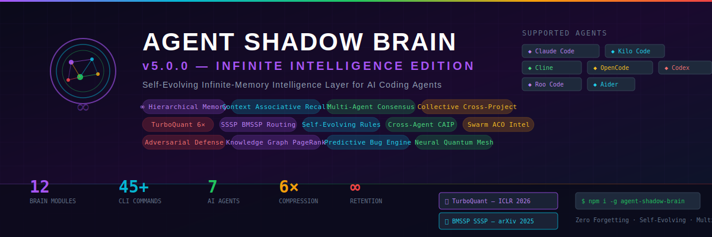

<div align="center">



<br/>

[](https://www.npmjs.com/package/@theihtisham/agent-shadow-brain)
[](https://www.npmjs.com/package/@theihtisham/agent-shadow-brain)
[](https://github.com/theihtisham/agent-shadow-brain/blob/master/LICENSE)
[](https://nodejs.org/)
[](https://github.com/theihtisham/agent-shadow-brain/stargazers)
[](https://arxiv.org/abs/2504.17033)
[](https://openreview.net/forum?id=TbqSEUXWaO)

<br/>

### **The World's First Infinite-Intelligence AI Coding Brain**

**Shadow Brain** is a self-evolving, infinite-memory intelligence layer for AI coding agents. It watches your code, applies **mathematically proven algorithms** from cutting-edge research, learns across sessions with **zero forgetting**, and makes every AI agent write **better, safer, faster code** — forever.

> **v5.0.0 — Infinite Intelligence Edition**: 4-tier hierarchical memory compression (raw → summary → pattern → principle), context-triggered associative recall, multi-agent consensus protocol with trust scoring, collective cross-project learning, TurboQuant 6x compression, SSSP O(m log<sup>2/3</sup>n) routing, self-evolving genetic rules, cross-agent protocol, adversarial hallucination defense, swarm intelligence, knowledge graph with PageRank, predictive bug forecasting.

[**Install Now**](#-getting-started) · [**v5.0.0 Modules**](#-v50-infinite-intelligence-engine) · [**Algorithms**](#-algorithms--research) · [**CLI Reference**](#-cli-reference) · [**Architecture**](#-architecture)

</div>

---

## The Problem

You use AI coding agents. They're powerful, but:

| Problem | Impact |
|---|---|
| Agents **forget everything** between sessions | Same mistakes, zero learning |
| Multiple agents **don't communicate** | Claude doesn't know what Cline learned |
| Generated code has **hallucinations** | LLMs fabricate APIs that don't exist |
| No **cross-session memory** | Every conversation starts from zero |
| No **cross-project learning** | Discoveries in one project don't help others |
| Agents can't **predict bugs** | Reactive, not proactive |
| No **self-improvement** | Rules never get better on their own |

## The Solution

**Shadow Brain v5.0.0** runs alongside your agents as an *infinite-intelligence shadow layer*:

```
┌──────────────┐    watches     ┌──────────────────────────────────────────┐    injects    ┌──────────────┐
│  AI Agents   │ ─────────────▶ │         SHADOW BRAIN v5.0.0              │ ────────────▶ │  AI Agents   │
│ Claude Code  │  file changes  │                                          │  insights +  │   Smarter    │
│ Kilo Code    │  git commits   │  ┌─ INFINITE MEMORY ──────────────────┐  │  context +   │   Safer      │
│ Cline        │  activity      │  │ Hierarchical 4-tier compression    │  │  fixes +     │   Faster     │
│ OpenCode     │                │  │ Context-Triggered Associative      │  │  predictions │   Connected  │
│ Codex        │                │  │ Recall — auto-activate memories    │  │              │   Evolving   │
│ Roo Code     │                │  └────────────────────────────────────┘  │              │   Predictive │
│ Aider        │                │  ┌─ MULTI-AGENT INTELLIGENCE ─────────┐  │              │   Trusted    │
└──────────────┘                │  │ Consensus Protocol — voting +      │  │              │   Infinite   │
         ▲                      │  │   trust scoring + conflict resolve │  │              └──────────────┘
         │                      │  │ Collective Learning — cross-project│  │                       ▲
         │                      │  │   rule sharing with verification   │  │                       │
         │                      │  └────────────────────────────────────┘  │                       │
         │                      │  ┌─ HYPER-INTELLIGENCE (v4) ──────────┐  │                       │
         │                      │  │ TurboQuant ─── 6x Compression       │  │                       │
         │                      │  │ SSSP BMSSP ─── Quantum Routing      │  │                       │
         │                      │  │ Self-Evolution ─ Living Rules       │  │                       │
         │                      │  │ CAIP ───────── Cross-Agent Sync     │  │                       │
         │                      │  │ Swarm ──────── File Hotspots        │  │                       │
         │                      │  │ PageRank ───── Impact Radar         │  │                       │
         │                      │  │ Adversarial ── Trust Verification   │  │                       │
         │                      │  └────────────────────────────────────┘  │                       │
         └──────────────────────┴──────────────────────────────────────────┴───────────────────────┘
                    shares insights across all agents via Cross-Agent Intelligence Protocol
```

---

## v5.0.0 Infinite Intelligence Engine

### 4 New Breakthrough Modules

<table>
<tr>
<td width="50%">

### Infinite Memory Layer

**Hierarchical Memory Compression** — 4-tier pyramid that never forgets.

Knowledge flows through compression tiers as it ages:
- **Raw** (50K entries) — full detail, hot path
- **Summary** (10K) — condensed key points
- **Pattern** (2K) — recurring patterns extracted
- **Principle** (500) — timeless design rules

Drill-down and drill-up between tiers. Older knowledge compresses, never deletes.

```bash
shadow-brain memory stats          # 4 tiers | 12,847 entries
shadow-brain memory store "..."    # Store new knowledge
shadow-brain memory search "auth"  # Cross-tier semantic search
```

**Context-Triggered Associative Recall** — memories that activate themselves.

Instead of requiring explicit search queries, this engine monitors your current work context and automatically surfaces relevant past knowledge:
- File path pattern matching (editing `auth/*.ts` → security memories)
- Keyword detection (typing "database" → SQL pattern memories)
- Category association (bug-fix context → past fix patterns)
- Co-occurrence networks (memories activated together strengthen their link)
- Learned trigger patterns that improve with use

```bash
shadow-brain recall . --file src/auth/login.ts --keywords "jwt,session"
# → Activates 8 memories | Top: "JWT rotation pattern (92%)"
```

</td>
<td width="50%">

### Multi-Agent Intelligence Layer

**Consensus Engine** — voting, trust scoring, conflict resolution.

When multiple AI agents observe the same codebase, they may produce conflicting insights. This engine:
1. Collects proposals from agents
2. Opens voting windows (agree/disagree/abstain with confidence)
3. Computes trust-weighted agreement scores
4. Resolves conflicts via confidence intervals
5. Tracks long-term agent trust based on proposal accuracy

```bash
shadow-brain consensus status       # 47 proposals | 89% acceptance rate
shadow-brain consensus propose "Use bcrypt for all password hashing" security 0.95
shadow-brain consensus vote <id> agree 0.9 "Industry standard"
shadow-brain consensus results      # All resolved proposals
```

**Collective Learning** — discoveries flow across all projects.

When you discover a pattern in Project A, it becomes a verified rule available in Project B:
- Rule proposal with evidence and verification
- Viral propagation across connected brain instances
- Accuracy tracking per rule (tested vs. false positive)
- Category-based organization (security, performance, architecture...)
- Trust scores for rule sources

```bash
shadow-brain collective status      # 234 rules | 12 categories
shadow-brain collective propose "Always validate file upload MIME types" security
shadow-brain collective search performance  # Cross-project performance rules
```

</td>
</tr>
</table>

---

## v4.0.0 Hyper-Intelligence Engine

### 8 Breakthrough Modules (included in v5.0.0)

<table>
<tr>
<td width="50%">

### Quantum Memory Layer

**TurboQuant Infinite Memory** — never forget anything, ever.

Based on Google Research's **TurboQuant** (ICLR 2026):
- **PolarQuant**: 2 bits per dimension (polar coordinate quantization)
- **QJL Residual**: 1 bit per dimension (random rotation + sign)
- **Total**: 3 bits/dim = **6x compression** with <1% accuracy loss
- **Result**: Infinite retention — old knowledge is compressed, never deleted

```bash
shadow-brain turbo stats    # Compression stats
shadow-brain turbo search "authentication patterns"
```

**SSSP Quantum Router** — deterministic shortest-path message routing.

Based on **"Breaking the Sorting Barrier"** (arXiv 2504.17033, Duan et al.):
- **BMSSP Algorithm**: O(m log<sup>2/3</sup> n) — breaks the sorting barrier
- **Deterministic**: No randomization, provably correct

```bash
shadow-brain route status   # Mesh routing status
shadow-brain route find node-A node-B
```

</td>
<td width="50%">

### Self-Evolution Layer

**Genetic Algorithm Self-Evolution** — rules that write themselves.

- **Population**: 50 genetic rule chromosomes
- **Selection**: Tournament (k=5) — survival of the fittest
- **Crossover**: Single-point recombination
- **Mutation**: Gaussian noise (Box-Muller transform, σ=0.1)
- **Fitness**: accuracy × coverage × (1 / falsePositiveRate)

```bash
shadow-brain evolve status
shadow-brain evolve run
shadow-brain evolve best-rules security
```

**Cross-Agent Intelligence Protocol (CAIP)** — agents that talk to each other.

Your Claude Code session learns what your Cline session discovered:
- Zero-config broadcast protocol
- Agent identification + insight tagging
- Multi-agent consensus building

```bash
shadow-brain caip status
shadow-brain caip broadcast "Security pattern detected"
```

</td>
</tr>
<tr>
<td width="50%">

### Defense & Trust Layer

**Adversarial Hallucination Defense** — trust nothing, verify everything.

- Cross-reference every critical insight against actual code
- Evidence scoring with confidence thresholds
- Verdict: `real` | `hallucinated` | `uncertain`

```bash
shadow-brain defense status
shadow-brain defense scan "This API endpoint exists at /api/v2/users"
```

**Swarm Intelligence** — Ant Colony Optimization for file prioritization.

- Pheromone deposit: +3 for critical, +2 for high, +1 for medium
- Evaporation: decay over time to avoid staleness

```bash
shadow-brain swarm status
shadow-brain swarm priorities
```

</td>
<td width="50%">

### Analytics & Prediction Layer

**Knowledge Graph + PageRank** — code impact radar.

- Identify high-impact files (change one, break many)
- Cycle detection in dependency graphs
- Entity extraction with file/line tracking

```bash
shadow-brain graph build .
shadow-brain graph pagerank
shadow-brain graph cycles
```

**Predictive Engine** — predict bugs before they happen.

- Bug risk scoring: `low` | `medium` | `high` | `critical`
- Technical debt forecasting
- Anomaly detection in change patterns

```bash
shadow-brain predict bugs .
```

</td>
</tr>
</table>

---

## Algorithms & Research

Shadow Brain v5.0.0 implements algorithms from **peer-reviewed research**:

| Algorithm | Paper / Origin | Application | Complexity |
|---|---|---|---|
| **Hierarchical Compression** | Novel 4-tier system | Infinite memory with drill-down | O(n) per tier |
| **Associative Recall** | Spreading activation model | Context-triggered memory activation | O(n × k) |
| **Consensus Protocol** | Byzantine fault tolerance | Multi-agent agreement with trust | O(v × log v) |
| **TurboQuant** | Google Research, ICLR 2026 | Vector compression (PolarQuant + QJL) | O(n) per vector |
| **BMSSP (SSSP)** | arXiv 2504.17033, Duan et al. | Neural mesh message routing | O(m log<sup>2/3</sup> n) |
| **Shannon Entropy** | Claude Shannon, 1948 | Cross-project insight relevance scoring | O(n) |
| **Bayesian Inference** | Thomas Bayes, 1763 | Confidence updating, meta-learning | O(1) per update |
| **Cosine Similarity** | Vector space model | Knowledge deduplication | O(d) per pair |
| **PageRank** | Brin & Page, 1998 | Code entity impact analysis | O(V + E) per iteration |
| **Tarjan's SCC** | Robert Tarjan, 1972 | Dependency cycle detection | O(V + E) |
| **Winnowing** | Schleimer et al., 2003 | Code duplicate fingerprinting | O(n) |
| **Box-Muller** | Box & Muller, 1958 | Gaussian mutation in genetic algorithm | O(1) per sample |
| **Ant Colony (ACO)** | Dorigo, 1992 | File priority pheromone system | O(n × m) |
| **Tournament Selection** | Goldberg, 1989 | Genetic rule selection (k=5) | O(k) per selection |

### TurboQuant Pipeline Detail

```
Input Vector (64-dim, float64)
     │
     ▼
┌─────────────┐
│  PolarQuant  │── Cartesian → Polar coordinates
│  2 bits/dim  │── Quantize angles to 4 levels (2 bits each)
└──────┬──────┘   Pack into Uint8Array
       │
       ▼
┌─────────────┐
│  QJL Residual│── Random rotation (Hadamard-like)
│  1 bit/dim   │── Sign extraction (1 bit per dim)
└──────┬──────┘   Pack into Uint8Array
       │
       ▼
  TurboVector { polar: Uint8Array, qjl: Uint8Array, dim: number, radius: number }
  = 3 bits/dim total = 6x compression from float64
  = ZERO FORGETTING — compressed knowledge stays searchable forever
```

### Hierarchical Memory Drill-Down

```
   ┌─────────────┐
   │  PRINCIPLE   │  500 entries — timeless design rules
   │  (top tier)  │  "Always validate inputs at system boundaries"
   └──────┬──────┘
          │ drill-down
   ┌──────┴──────┐
   │   PATTERN    │  2K entries — recurring patterns
   │              │  "Input validation pattern: zod schema → middleware → handler"
   └──────┬──────┘
          │ drill-down
   ┌──────┴──────┐
   │   SUMMARY    │  10K entries — condensed key points
   │              │  "auth/login.ts uses JWT with bcrypt — verified secure"
   └──────┬──────┘
          │ drill-down
   ┌──────┴──────┐
   │     RAW      │  50K entries — full detail, hot path
   │  (base tier) │  Complete analysis of login.ts with all evidence
   └─────────────┘
```

---

## Features

<table>
<tr>
<td width="25%">

### Infinite Intelligence (v5)
- 4-tier hierarchical memory
- Context-triggered recall
- Multi-agent consensus
- Collective cross-project learning

</td>
<td width="25%">

### Hyper-Intelligence (v4)
- TurboQuant infinite memory
- SSSP quantum routing
- Self-evolving genetic rules
- Cross-agent protocol (CAIP)
- Adversarial defense
- Swarm intelligence (ACO)
- Knowledge Graph + PageRank
- Predictive bug forecasting

</td>
<td width="25%">

### Real-Time Intelligence
- File watching (chokidar)
- Git monitoring (commits, diffs)
- LLM analysis (Anthropic, OpenAI, Ollama)
- Pattern memory across sessions
- Learning engine (automatic)

</td>
<td width="25%">

### Developer Experience
- **45+ CLI commands** — full terminal control
- MCP Server — Model Context Protocol
- Web dashboard — `localhost:7341`
- Terminal UI — Ink/React dashboard
- Pre-commit hooks — block bad commits
- GitHub Actions — CI integration

</td>
</tr>
</table>

---

## Architecture


### v5.0.0 Module Map

| Module | File | What It Does | Since |
|---|---|---|---|
| **Hierarchical Memory** | `brain/hierarchical-memory.ts` | 4-tier infinite memory with drill-down | v5.0.0 |
| **Context Recall** | `brain/context-recall.ts` | Associative memory activation engine | v5.0.0 |
| **Consensus Engine** | `brain/consensus-engine.ts` | Multi-agent voting + trust scoring | v5.0.0 |
| **Collective Learning** | `brain/collective-learning.ts` | Cross-project rule sharing | v5.0.0 |
| **TurboMemory** | `brain/turbo-memory.ts` | 6x compressed infinite memory | v4.0.0 |
| **SSSP Router** | `brain/sssp-router.ts` | Sub-sorting-complexity routing | v4.0.0 |
| **Self-Evolution** | `brain/self-evolution.ts` | Genetic rule optimization | v4.0.0 |
| **Cross-Agent** | `brain/cross-agent-protocol.ts` | Multi-agent broadcast | v4.0.0 |
| **Adversarial** | `brain/adversarial-defense.ts` | Hallucination detection | v4.0.0 |
| **Swarm** | `brain/swarm-intelligence.ts` | File priority pheromones | v4.0.0 |
| **Knowledge Graph** | `brain/knowledge-graph.ts` | PageRank impact analysis | v4.0.0 |
| **Predictive** | `brain/predictive-engine.ts` | Bug risk & debt forecasting | v4.0.0 |

---

## Getting Started

### Install

```bash
# Install globally
npm install -g @theihtisham/agent-shadow-brain

# Or use with npx (no install needed)
npx @theihtisham/agent-shadow-brain review .
```

### One-Command Setup

```bash
shadow-brain setup
```

### Start Watching

```bash
shadow-brain start .
```

That's it. Shadow Brain will:
1. Auto-detect which AI agents are running (7 supported)
2. Watch your project files for changes
3. Analyze every change with LLM + mathematical algorithms
4. Inject expert insights into your agent's memory
5. Store all knowledge in hierarchical memory for infinite retention
6. Activate past memories automatically based on context
7. Share verified patterns across projects via collective learning
8. Compress knowledge with TurboQuant for infinite retention
9. Evolve its own rules via genetic algorithm
10. Share insights across agents via CAIP
11. Detect hallucinations with adversarial verification
12. Run consensus when multiple agents disagree

### Quick Review (No Watch Mode)

```bash
shadow-brain review .                    # One-shot analysis
shadow-brain review . --show-health      # + health score
shadow-brain review . --show-fixes       # + fix suggestions
shadow-brain review . --output json      # JSON for scripting
```

### v5.0.0 Commands

```bash
# Infinite hierarchical memory
shadow-brain memory stats                # 4-tier compression stats
shadow-brain memory store "knowledge"    # Store at raw tier
shadow-brain memory search "auth"        # Cross-tier search

# Context-triggered recall
shadow-brain recall . --file src/auth.ts --keywords "jwt,token"

# Multi-agent consensus
shadow-brain consensus status            # Proposal + trust stats
shadow-brain consensus propose "..." security 0.95
shadow-brain consensus vote <id> agree 0.9 "Reason"
shadow-brain consensus results           # All resolved proposals

# Collective cross-project learning
shadow-brain collective status           # Rule count + categories
shadow-brain collective propose "Rule" security
shadow-brain collective search performance

# Run EVERYTHING at once
shadow-brain v5 .                        # Full v5.0.0 infinite-intelligence analysis
```

### v4.0.0 Commands (still available)

```bash
shadow-brain turbo stats                 # TurboQuant compression stats
shadow-brain turbo search "auth"         # Semantic search in compressed memory
shadow-brain route status                # SSSP mesh routing status
shadow-brain route find node-A node-B    # Shortest path between brain nodes
shadow-brain caip status                 # Connected agents
shadow-brain caip broadcast "message"    # Broadcast to all agents
shadow-brain evolve status               # Genetic algorithm stats
shadow-brain evolve run                  # Evolve one generation
shadow-brain evolve best-rules security  # Top evolved security rules
shadow-brain predict bugs .              # Bug risk scoring
shadow-brain graph build .               # Build + PageRank
shadow-brain graph pagerank              # Top impact entities
shadow-brain swarm status                # Convergence + pheromone stats
shadow-brain swarm priorities            # File hotspot ranking
shadow-brain defense status              # Accuracy + blocked count
shadow-brain defense scan "claim text"   # Verify a specific claim
shadow-brain v4 .                        # Full v4.0.0 hyper-analysis
```

---

## CLI Reference

### Core Commands

| Command | Description |
|---|---|
| `shadow-brain start [dir]` | Start real-time watching |
| `shadow-brain review [dir]` | One-shot code analysis |
| `shadow-brain health [dir]` | Health score (A-F grading) |
| `shadow-brain fix [dir]` | Smart fix suggestions |
| `shadow-brain report [dir]` | HTML/MD/JSON reports |
| `shadow-brain metrics [dir]` | Code metrics |
| `shadow-brain scan [dir]` | Vulnerability scanner |
| `shadow-brain pr [dir]` | Generate PR description |
| `shadow-brain commit-msg [dir]` | Generate commit message |
| `shadow-brain ci [dir]` | GitHub Actions workflow |
| `shadow-brain hook [dir]` | Pre-commit hook |
| `shadow-brain dash [dir]` | Web dashboard |
| `shadow-brain inject <msg>` | Inject into agent memory |
| `shadow-brain status` | Current configuration |
| `shadow-brain setup` | Interactive setup wizard |
| `shadow-brain doctor` | Health check & diagnostics |

### v5.0.0 Infinite Intelligence Commands

| Command | Description |
|---|---|
| `shadow-brain memory stats` | 4-tier hierarchical memory stats |
| `shadow-brain memory store <text>` | Store knowledge at raw tier |
| `shadow-brain memory search <query>` | Cross-tier semantic search |
| `shadow-brain recall . --file <f>` | Context-triggered associative recall |
| `shadow-brain consensus status` | Multi-agent consensus stats |
| `shadow-brain consensus propose <text> <cat> <conf>` | Submit proposal for voting |
| `shadow-brain consensus vote <id> <vote> <conf> <reason>` | Vote on a proposal |
| `shadow-brain consensus results` | All resolved proposals |
| `shadow-brain collective status` | Cross-project rule stats |
| `shadow-brain collective propose <text> <cat>` | Propose a collective rule |
| `shadow-brain collective search <cat>` | Search collective rules by category |
| `shadow-brain v5 [dir]` | Run ALL v5.0.0 analyses |

### v4.0.0 Hyper-Intelligence Commands

| Command | Description |
|---|---|
| `shadow-brain turbo stats` | TurboQuant infinite memory stats |
| `shadow-brain turbo search <q>` | Semantic search compressed memory |
| `shadow-brain route status` | SSSP routing status |
| `shadow-brain route find <from> <to>` | Shortest path query |
| `shadow-brain caip status` | Cross-agent protocol status |
| `shadow-brain caip broadcast <msg>` | Broadcast to all agents |
| `shadow-brain evolve status` | Genetic algorithm generation stats |
| `shadow-brain evolve run` | Trigger evolution cycle |
| `shadow-brain evolve best-rules [cat]` | Top evolved rules by category |
| `shadow-brain predict bugs [dir]` | Bug risk prediction |
| `shadow-brain graph build [dir]` | Build knowledge graph + PageRank |
| `shadow-brain swarm status` | Swarm convergence + priorities |
| `shadow-brain swarm priorities` | File hotspot ranking |
| `shadow-brain defense status` | Adversarial defense statistics |
| `shadow-brain defense scan <text>` | Scan text for hallucination patterns |
| `shadow-brain v4 [dir]` | Run ALL v4.0.0 analyses |

### Super-Intelligence Commands (v2.0+)

| Command | Description |
|---|---|
| `shadow-brain semantic [dir]` | Symbol extraction, dead code |
| `shadow-brain deps [dir]` | Dependency graph, cycles, hubs |
| `shadow-brain duplicates [dir]` | Duplicate code detection |
| `shadow-brain adr [dir]` | Architecture Decision Records |
| `shadow-brain typesafety [dir]` | TypeScript type analysis |
| `shadow-brain perf [dir]` | Performance profiling |
| `shadow-brain knowledge [dir]` | Project knowledge base |
| `shadow-brain learn [dir]` | Extract patterns & lessons |

### Neural Mesh Commands (v2.1+)

| Command | Description |
|---|---|
| `shadow-brain mesh status` | Mesh state + quantum state |
| `shadow-brain mesh insights` | Cross-session insights |
| `shadow-brain mesh knowledge` | Shared knowledge base |
| `shadow-brain mesh nodes` | Connected brain nodes |

---

## Programmatic API

```typescript
import {
  Orchestrator,
  HierarchicalMemory,
  ContextRecall,
  ConsensusEngine,
  CollectiveLearning,
  TurboMemory,
  SSSPRouter,
  SelfEvolution,
  CrossAgentProtocol,
  AdversarialDefense,
  SwarmIntelligence,
  KnowledgeGraph,
  PredictiveEngine,
  NeuralMesh,
} from '@theihtisham/agent-shadow-brain';

// Create the brain
const brain = new Orchestrator({
  provider: 'anthropic',
  projectDir: './my-project',
  agents: ['claude-code', 'cline', 'roo-code'],
  watchMode: true,
  autoInject: true,
  brainPersonality: 'balanced',
});

// v5.0.0 — Infinite Intelligence
const hmem = new HierarchicalMemory();
await hmem.store('JWT rotation pattern: rotate every 24h with refresh tokens', 'security', 0.9);
const results = hmem.search('jwt');  // Cross-tier search

const recall = new ContextRecall(hmem);
const activated = recall.recall({
  currentFile: 'src/auth/login.ts',
  currentCategory: 'security',
  recentEdits: ['src/auth/login.ts', 'src/middleware/auth.ts'],
  projectType: 'node',
  keywords: ['jwt', 'authentication', 'session'],
  timeOfDay: 14,
  dayOfWeek: 2,
});

const consensus = new ConsensusEngine('my-agent');
const proposalId = consensus.propose('Use bcrypt cost factor 12', 'security', 0.95);
consensus.vote(proposalId, 'agree', 0.9, 'Industry standard per OWASP');

const collective = new CollectiveLearning();
collective.proposeRule('Validate file upload MIME types', 'security', 'my-agent', ['./uploads']);

// v4.0.0 — Direct module access
const turbo = new TurboMemory({ maxEntries: 100000 });
await turbo.store('auth-pattern', vector, { category: 'security' });

const evolution = new SelfEvolution({ populationSize: 50 });
const snapshot = await evolution.evolve(insights);

const kg = new KnowledgeGraph('./my-project');
await kg.build();
const topEntities = kg.getTopEntities(10);

// Start everything
await brain.start();
```

---

## Health Score System

| Dimension | Weight | Checks |
|---|---|---|
| Security | 25% | Vulnerabilities, secrets, exposed keys |
| Quality | 25% | Code smells, anti-patterns, complexity |
| Performance | 15% | N+1 queries, memory leaks, blocking ops |
| Architecture | 15% | Coupling, cohesion, dependencies |
| Maintainability | 10% | Duplication, file sizes, comments |
| Test Coverage | 10% | Test presence, assertion quality |

---

## Version History

### v5.0.0 — Infinite Intelligence Edition (Current)
- **Hierarchical Memory Compression** — 4-tier pyramid (raw → summary → pattern → principle) with drill-down/up
- **Context-Triggered Associative Recall** — automatic memory activation based on file paths, keywords, categories, co-occurrence networks
- **Multi-Agent Consensus Protocol** — trust-weighted voting, confidence intervals, conflict resolution, long-term trust scoring
- **Collective Cross-Project Learning** — verified rule sharing, viral propagation, accuracy tracking, category-based organization
- **5 new CLI commands** — memory, recall, consensus, collective, v5
- **4 new modules**, 2,000+ lines of new code
- All v4.0.0 features included and enhanced

### v4.0.0 — Hyper-Intelligence Edition
- **TurboQuant Infinite Memory** — 6x compression, zero forgetting (Google Research, ICLR 2026)
- **SSSP BMSSP Routing** — O(m log<sup>2/3</sup>n) deterministic routing (arXiv 2504.17033)
- **Self-Evolving Genetic Rules** — tournament selection, Gaussian mutation, Bayesian meta-learning
- **Cross-Agent Intelligence Protocol** — 7 agents share insights in real-time
- **Adversarial Hallucination Defense** — cross-reference verification, evidence scoring
- **Swarm Intelligence** — Ant Colony pheromone file prioritization
- **Knowledge Graph + PageRank** — code impact radar with d=0.85 damping
- **Predictive Engine** — bug risk scoring, debt forecasting, anomaly detection
- **9 new CLI commands** — turbo, route, caip, evolve, predict, graph, swarm, defense, v4

### v3.0.0 — Hyper-Intelligence Edition
- Cognitive load analysis
- Security audit engine
- Influence map (cross-file impact)

### v2.1.0 — Quantum Neural Mesh
- Cross-session shared intelligence
- Shannon entropy relevance scoring
- Cosine similarity knowledge dedup
- Bayesian confidence updating

### v2.0.0 — Super-Intelligence Edition
- Semantic analyzer, dependency graph, code similarity
- ADR engine, type safety, performance profiler
- MCP Server, team mode, multi-project

### v1.x — Foundation
- 7 agent adapters, health scoring, smart fixes
- Vulnerability scanning, custom rules, notifications
- CI/CD integration, pre-commit hooks

---

## Supported Agents

| Agent | Status | Injection Target |
|---|---|---|
| [Claude Code](https://docs.anthropic.com/en/docs/claude-code) | Full Support | `CLAUDE.md`, `.claude/` |
| [Kilo Code](https://kilocode.ai/) | Full Support | `.kilocode/rules.md` |
| [Cline](https://github.com/cline/cline) | Full Support | `.clinerules` |
| [OpenCode](https://github.com/opencode-ai/opencode) | Full Support | `AGENT.md` |
| [Codex](https://github.com/openai/codex) | Full Support | `AGENTS.md` |
| [Roo Code](https://roocode.com/) | Full Support | `.roo/rules.md` |
| [Aider](https://aider.chat/) | Full Support | `.aider.conf.yml` |

---

## Development

```bash
git clone https://github.com/theihtisham/agent-shadow-brain.git
cd agent-shadow-brain
npm install
npm run build
npm test
```

---

## Roadmap

- [x] ~~MCP Server, multi-project, team mode~~ (v2.0)
- [x] ~~Cross-session neural mesh~~ (v2.1)
- [x] ~~TurboQuant infinite memory~~ (v4.0)
- [x] ~~SSSP quantum routing~~ (v4.0)
- [x] ~~Self-evolving rules~~ (v4.0)
- [x] ~~Cross-agent protocol~~ (v4.0)
- [x] ~~Adversarial hallucination defense~~ (v4.0)
- [x] ~~Hierarchical memory compression~~ (v5.0)
- [x] ~~Context-triggered associative recall~~ (v5.0)
- [x] ~~Multi-agent consensus protocol~~ (v5.0)
- [x] ~~Collective cross-project learning~~ (v5.0)
- [ ] **IDE extensions** — VS Code extension for inline insights
- [ ] **Custom LLM fine-tuning** — train on your codebase patterns
- [ ] **Docker image** — one-command containerized deployment
- [ ] **Web dashboard v2** — React-based interactive analytics
- [ ] **Language server** — LSP protocol for real-time feedback

---

## License

MIT License — see [LICENSE](LICENSE) for details.

---

## Author

**theihtisham**

[](https://github.com/theihtisham)
[](https://www.npmjs.com/~theihtisham)

---

<div align="center">

### If Shadow Brain makes your AI agents smarter, give it a star

[](https://star-history.com/#theihtisham/agent-shadow-brain&Date)

**Built with brains by [theihtisham](https://github.com/theihtisham)**

**Topics:** `ai` `artificial-intelligence` `llm` `claude-code` `cline` `kilo-code` `codex` `roo-code` `aider` `opencode` `code-review` `static-analysis` `developer-tools` `npm-package` `typescript` `ollama` `openai` `anthropic` `code-quality` `security-scanner` `health-score` `smart-fix` `vulnerability-scanner` `pattern-learning` `agent-tools` `ai-agent` `code-metrics` `pre-commit-hook` `github-actions` `developer-productivity` `neural-mesh` `quantum-computing` `shannon-entropy` `bayesian-inference` `mcp-server` `semantic-analysis` `dependency-graph` `turboquant` `sssp-algorithm` `genetic-algorithm` `swarm-intelligence` `pagerank` `knowledge-graph` `hallucination-detection` `cross-agent` `self-evolving` `predictive-engine` `ant-colony` `infinite-memory` `vector-compression` `iclr-2026` `arxiv` `super-intelligence` `hyper-intelligence` `autonomous-agents` `ai-engineering` `agentic-coding` `vibe-coding` `hierarchical-memory` `context-recall` `consensus-engine` `collective-learning` `infinite-intelligence`

</div>
