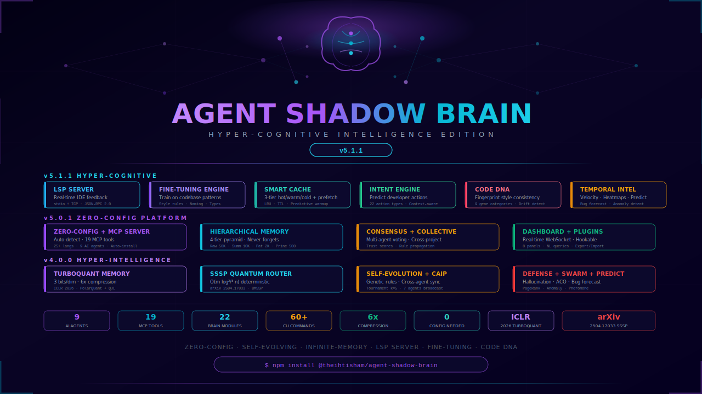

<div align="center">



<br/>

[](https://www.npmjs.com/package/@theihtisham/agent-shadow-brain)
[](https://www.npmjs.com/package/@theihtisham/agent-shadow-brain)
[](https://github.com/theihtisham/agent-shadow-brain/blob/master/LICENSE)
[](https://nodejs.org/)
[](https://github.com/theihtisham/agent-shadow-brain/stargazers)
[](https://arxiv.org/abs/2504.17033)
[](https://openreview.net/forum?id=TbqSEUXWaO)
[](#)
[](#)
[](#)

<br/>

### **The World's #1 Hyper-Cognitive AI Coding Brain**

**Shadow Brain** is a zero-config, self-evolving, infinite-memory intelligence layer that makes **every AI coding agent** write better, safer, faster code. Install it once, and it automatically detects your project, your AI tools, your frameworks — and starts making your agents smarter forever.

> **v5.1.1 — Hyper-Cognitive Intelligence Edition**: 6 new brain modules — **Built-in LSP Server** for real-time IDE feedback, **Custom LLM Fine-Tuning Engine** to train on your codebase, **Smart Cache** with multi-tier predictive prefetch, **Intent Engine** for natural language command understanding, **Code DNA** fingerprinting with 9-gene analysis, and **Temporal Intelligence** for velocity tracking & bug prediction. Plus all v5.0.1 zero-config features (MCP server, dashboard, plugins, export/import), v5.0.0 infinite intelligence (hierarchical memory, consensus, collective learning), and v4.0.0 hyper-intelligence (TurboQuant, SSSP, self-evolution, adversarial defense, swarm, knowledge graph, predictive engine).

[**Install Now**](#-getting-started-30-seconds) · [**Dashboard**](#-web-dashboard) · [**v5.1.1 New**](#-v511-whats-new) · [**Algorithms**](#-algorithms--research) · [**CLI Reference**](#-cli-reference) · [**Architecture**](#-architecture)

</div>

---

## The Problem

You use AI coding agents. They're powerful, but:

| Problem | Impact |
|---|---|
| Agents **forget everything** between sessions | Same mistakes, zero learning |
| Multiple agents **don't communicate** | Claude doesn't know what Cursor learned |
| Generated code has **hallucinations** | LLMs fabricate APIs that don't exist |
| No **cross-session memory** | Every conversation starts from zero |
| No **cross-project learning** | Discoveries in one project don't help others |
| Setup is **complicated** | 30 minutes of config before anything works |
| Each tool needs **separate config** | Claude, Cursor, Cline all need different setup |

## The Solution

**Shadow Brain v5.1.1** — zero-config, auto-detecting, infinite-intelligence shadow layer:

```
┌──────────────┐    auto-detect     ┌──────────────────────────────────────────┐
│  AI Agents   │ ◀────────────────  │         SHADOW BRAIN v5.1.1              │
│ Claude Code  │  MCP auto-install  │                                          │
│ Cursor       │  zero-config       │  ┌─ HYPER-COGNITIVE (v5.1.1 NEW) ────┐  │
│ Kilo Code    │                    │  │ Built-in LSP Server (stdio+TCP)   │  │
│ Cline        │    watches         │  │ Custom LLM Fine-Tuning Engine     │  │
│ OpenCode     │ ──────────────▶   │  │ Smart Cache (hot/warm/cold tiers) │  │
│ Codex        │  file changes      │  │ Intent Engine (NLP commands)      │  │
│ Roo Code     │  git commits       │  │ Code DNA (9-gene fingerprinting) │  │
│ Aider        │  activity          │  │ Temporal Intelligence (velocity)  │  │
│ Windsurf     │                    │  └────────────────────────────────────┘  │
└──────────────┘                    │  ┌─ ZERO-CONFIG (v5.0.1) ─────────────┐  │
         ▲                          │  │ Auto-detect + MCP + Dashboard      │  │
         │                          │  │ Plugins + Export/Import + Hooks    │  │
         │                          │  └────────────────────────────────────┘  │
         │                          │  ┌─ INFINITE MEMORY (v5.0.0) ────────┐  │
         │                          │  │ 4-tier hierarchical compression    │  │
         │                          │  │ Context-triggered recall            │  │
         │                          │  │ Multi-agent consensus + trust       │  │
         │                          │  │ Collective cross-project learning   │  │
         │                          │  └────────────────────────────────────┘  │
         │                          │  ┌─ HYPER-INTELLIGENCE (v4) ──────────┐  │
         │                          │  │ TurboQuant 6x Compression           │  │
         │                          │  │ SSSP BMSSP Quantum Routing          │  │
         │                          │  │ Self-Evolution + CAIP + Swarm       │  │
         │                          │  │ PageRank + Predictive + Adversarial │  │
         └──────────────────────────┴──────────────────────────────────────────┘
```

---

## v5.1.1 — What's New

### 6 Hyper-Cognitive Brain Modules

<table>
<tr>
<td width="50%">

### Built-in LSP Server

**Language Server Protocol** — real-time IDE feedback without external tools.

Pure Node.js LSP server supporting stdio and TCP transport modes:
- **Diagnostics**: pushes brain insights as IDE warnings/errors
- **Hover**: shows code health info on hover
- **Code Actions**: quick-fix suggestions from brain analysis
- **Zero dependency**: no external LSP libraries required

```bash
shadow-brain lsp --stdio          # stdio mode (for editors)
shadow-brain lsp --tcp 2087       # TCP mode (for remote)
```

### Custom LLM Fine-Tuning Engine

**Train on your codebase** — your brain learns YOUR patterns.

Automatic training data generation from code changes, insights, and fixes:
- **Pair extraction**: before/after code → training pairs
- **Pattern mining**: recurring fix patterns → fine-tune examples
- **JSONL export**: ready for OpenAI, Anthropic, or local fine-tuning
- **Quality scoring**: only high-confidence pairs enter the dataset

```bash
shadow-brain fine-tune status             # Training data stats
shadow-brain fine-tune generate [dir]     # Generate training pairs
shadow-brain fine-tune export [path]      # Export JSONL dataset
```

</td>
<td width="50%">

### Smart Cache (Multi-Tier)

**Hot/Warm/Cold** — intelligent caching with predictive prefetch.

Three-tier LRU cache with automatic promotion and demotion:
- **Hot tier**: 200 entries, fastest access
- **Warm tier**: 1000 entries, promoted on repeated access
- **Cold tier**: 5000 entries, compressed storage
- **Predictive prefetch**: co-access graph predicts what you'll need next
- **Tag-based invalidation**: invalidate by category

```bash
shadow-brain cache stats          # Hit rate, tier sizes, memory usage
shadow-brain cache clear          # Clear all tiers
```

### Intent Engine

**Natural language → brain actions** — understand what you mean.

Multi-strategy NLP command understanding:
- **Keyword matching**: fast path for common commands
- **Fuzzy matching**: handles typos and variations
- **Context-aware**: uses current file/project context
- **Confidence scoring**: routes to best-matching action

```bash
shadow-brain intent "find security bugs"    # Maps to: analyze + security filter
shadow-brain intent "show hot files"        # Maps to: temporal + heatmap
```

</td>
</tr>
<tr>
<td width="50%">

### Code DNA Fingerprinting

**9-gene analysis** — every file gets a unique genetic profile.

Analyzes code across 9 gene categories to create a structural fingerprint:
- **Structure genes**: classes, functions, nesting depth
- **Complexity genes**: cyclomatic complexity, cognitive load
- **Style genes**: naming conventions, formatting patterns
- **Dependency genes**: import graph, coupling metrics
- **Evolution genes**: change frequency, stability score
- **Similarity matching**: find structurally similar files across projects

```bash
shadow-brain dna analyze [dir]    # Generate DNA profiles
shadow-brain dna compare f1 f2    # Compare two file fingerprints
shadow-brain dna similar [file]   # Find similar files
```

</td>
<td width="50%">

### Temporal Intelligence

**Time-series code evolution** — velocity tracking & bug prediction.

Continuous monitoring of code change patterns over time:
- **Velocity metrics**: daily/weekly/monthly rates with trend detection
- **File heatmaps**: hotness scoring, churn risk, stability
- **Bug prediction**: 5-factor probability model per file
- **Anomaly detection**: burst detection, drought alerts, unusual hours
- **Peak analysis**: identifies your most productive hours and days

```bash
shadow-brain temporal stats       # Velocity, anomalies, predictions
shadow-brain temporal hot         # Top 10 hottest files
shadow-brain temporal predict     # Bug risk predictions
shadow-brain temporal timeline    # Recent event timeline
```

</td>
</tr>
</table>

---

## v5.0.1 — What's New

### Zero-Config Auto-Setup

Install it. That's it. Shadow Brain automatically:

- Detects your project type (frontend, backend, fullstack, mobile, game, systems, data-science)
- Detects 25+ languages, 15+ frameworks, 5+ build tools, 5+ test frameworks
- Detects which AI tools are installed (Claude Code, Cursor, Kilo Code, Cline, OpenCode, Codex, Aider, Windsurf)
- Auto-installs MCP server configuration for every detected AI tool
- Auto-installs git pre-commit and pre-push hooks
- Generates an optimal brain config based on project complexity

```bash
npm install @theihtisham/agent-shadow-brain
# → Shadow Brain v5.1.1 auto-configured for my-app (fullstack)
# → AI tools detected: Claude Code, Cursor
# → Run: shadow-brain start
```

### MCP Server — Works with EVERY AI Tool

The brain exposes itself as a **Model Context Protocol (MCP) server** with 19 tools that any AI tool can call:

| MCP Tool | What It Does |
|---|---|
| `brain_status` | Get full brain status |
| `brain_analyze` | Trigger code analysis |
| `brain_health` | Get health score (A-F) |
| `brain_insights` | Get recent insights |
| `brain_fixes` | Get smart fix suggestions |
| `brain_memory_store` | Store knowledge in hierarchical memory |
| `brain_memory_search` | Search across all memory tiers |
| `brain_memory_stats` | Memory compression statistics |
| `brain_recall` | Context-triggered associative recall |
| `brain_consensus_propose` | Submit a proposal for agent consensus |
| `brain_consensus_vote` | Vote on a pending proposal |
| `brain_collective_propose` | Propose a cross-project rule |
| `brain_collective_search` | Search collective learning rules |
| `brain_turbo_search` | Semantic search in compressed memory |
| `brain_predict` | Predict bug risk for files |
| `brain_graph_query` | Query knowledge graph |
| `brain_defense_scan` | Scan for hallucination patterns |
| `brain_evolve_status` | Get self-evolution status |
| `brain_dashboard_url` | Get dashboard URL |

Works with **Claude Code**, **Cursor**, **Kilo Code**, **Cline**, **OpenCode**, and any MCP-compatible AI tool.

```bash
# Start MCP server (auto-started by AI tools)
shadow-brain mcp

# Cursor compatibility (root path POST + /v1/chat)
# Claude Code compatibility (JSON-RPC 2.0 over stdio/HTTP)
```

### Rich Web Dashboard

Real-time browser dashboard at `http://localhost:7341` with WebSocket live updates:

- **Stats Topbar**: 8 live counters — Insights, Fixes, Memory KB, Modules, AI Tools, Evolution Gen, Swarm Convergence, Turbo Compression
- **Health Score**: A-F grading with dimension breakdown (Security, Quality, Performance, Architecture, Maintainability, Test Coverage)
- **Memory Tiers**: Visual bars showing Raw (50K), Summary (10K), Pattern (2K), Principle (500) with Turbo compression ratio
- **Live Insights Stream**: Real-time feed of brain insights with priority badges
- **Smart Fixes**: Actionable fix suggestions with file/line references
- **AI Tools Panel**: 8 tools showing connected/detected status
- **Brain Modules**: 13 modules with active/idle/error indicators
- **Control Buttons**: Trigger analysis on-demand, refresh data

```bash
shadow-brain start .     # Dashboard auto-starts at http://localhost:7341
shadow-brain dash .      # Dashboard only mode
```

### Natural Language Queries

Ask your brain questions in plain English:

```bash
shadow-brain ask "What security issues exist in the auth module?"
shadow-brain ask "Which files have the highest bug risk?"
shadow-brain ask "What patterns have we learned about React hooks?"
```

### Brain Export/Import — Team Sync

Export your brain state and share it with your team:

```bash
shadow-brain export                    # Full export with all modules
shadow-brain export -o ./team-brain    # Custom output directory
shadow-brain import brain-export.json  # Import + merge
shadow-brain import brain-export.json --merge --skip swarm,evolution
```

### Plugin System

Extend Shadow Brain with custom plugins:

```bash
shadow-brain plugin list               # List installed plugins
shadow-brain plugin create my-plugin   # Create from template
shadow-brain plugin stats              # Plugin system statistics
```

Plugins can hook into `pre-analysis` and `post-analysis` pipelines to add custom insights, filter results, or integrate with external services.

### 5 New Commands

```bash
shadow-brain off          # Clean shutdown
shadow-brain ask "..."    # Natural language query
shadow-brain export       # Export brain state
shadow-brain import FILE  # Import brain state
shadow-brain plugin CMD   # Plugin management
```

---

## Getting Started — 30 Seconds

```bash
# Install globally
npm install -g @theihtisham/agent-shadow-brain

# Or use npx (no install needed)
npx @theihtisham/agent-shadow-brain start .
```

That's literally it. Shadow Brain will:
1. **Auto-detect** your project, languages, frameworks, AI tools (zero config)
2. **Auto-install** MCP server config for Claude Code, Cursor, Kilo Code, Cline, etc.
3. **Auto-install** git hooks for pre-commit and pre-push
4. Watch your project files for changes
5. Analyze every change with LLM + 22 brain modules
6. Inject expert insights into your agent's memory
7. Store all knowledge in hierarchical memory for infinite retention
8. Activate past memories automatically based on context
9. Share verified patterns across projects via collective learning
10. Compress knowledge with TurboQuant for infinite retention
11. Evolve its own rules via genetic algorithm
12. Share insights across agents via CAIP
13. Detect hallucinations with adversarial verification
14. Run consensus when multiple agents disagree
15. Serve a rich web dashboard at `localhost:7341`

### Quick Review (No Watch Mode)

```bash
shadow-brain review .                    # One-shot analysis
shadow-brain review . --show-health      # + health score
shadow-brain review . --show-fixes       # + fix suggestions
shadow-brain review . --output json      # JSON for scripting
```

---

## Web Dashboard

The v5.1.1 dashboard provides a real-time view into your brain:

```
┌──────────────────────────────────────────────────────────────────────────┐
│  Shadow Brain v5.1.1                                     [Analyze] [↻] │
├──────────────────────────────────────────────────────────────────────────┤
│  Insights: 142 │ Fixes: 38 │ Memory: 247KB │ Modules: 22/22 │ ...     │
├──────────────┬─────────────────────────────────────┬───────────────────┤
│ Health: 87%  │  Live Insights Stream               │ AI Tools          │
│ ████████░░   │  ● [HIGH] SQL injection in login.ts │ ● Claude Code ✓  │
│ Security: A  │  ● [MED] Missing error handling     │ ● Cursor    ✓    │
│ Quality: B+  │  ● [LOW] Unused import in utils     │ ● Kilo Code ✓    │
│ Perf:    A-  │  ● [CRIT] Exposed API key           │ ● Cline     —    │
│ Arch:    B   │                                     │ ● OpenCode  —    │
│ Maintain: A  ├─────────────────────────────────────┤ ● Codex     —    │
│ Tests:   C+  │  Smart Fixes                        │ ● Aider     —    │
│              │  1. Add parameterized query...       │ ● Windsurf  —    │
├──────────────┤  2. Wrap in try/catch with...       ├───────────────────┤
│ Memory Tiers │  3. Remove unused import on L42     │ Brain Modules     │
│ Raw:   8421  │                                     │ ● Hierarchical ✓  │
│ Summ:  1203  │                                     │ ● TurboMemory  ✓  │
│ Patt:   187  │                                     │ ● Consensus    ✓  │
│ Princ:    24 │                                     │ ● Swarm        ✓  │
│ Turbo: 6.2x  │                                     │ ● Evolution    ✓  │
│              │                                     │ ● Adversarial  ✓  │
└──────────────┴─────────────────────────────────────┴───────────────────┘
```

---

## v5.0.0 Infinite Intelligence Engine

### 4 Breakthrough Modules

<table>
<tr>
<td width="50%">

### Infinite Memory Layer

**Hierarchical Memory Compression** — 4-tier pyramid that never forgets.

Knowledge flows through compression tiers as it ages:
- **Raw** (50K entries) — full detail, hot path
- **Summary** (10K) — condensed key points
- **Pattern** (2K) — recurring patterns extracted
- **Principle** (500) — timeless design rules

Drill-down and drill-up between tiers. Older knowledge compresses, never deletes.

```bash
shadow-brain memory stats          # 4 tiers | 12,847 entries
shadow-brain memory store "..."    # Store new knowledge
shadow-brain memory search "auth"  # Cross-tier semantic search
```

**Context-Triggered Associative Recall** — memories that activate themselves.

Instead of requiring explicit search queries, this engine monitors your current work context and automatically surfaces relevant past knowledge:
- File path pattern matching (editing `auth/*.ts` → security memories)
- Keyword detection (typing "database" → SQL pattern memories)
- Category association (bug-fix context → past fix patterns)
- Co-occurrence networks (memories activated together strengthen their link)
- Learned trigger patterns that improve with use

```bash
shadow-brain recall . --file src/auth/login.ts --keywords "jwt,session"
# → Activates 8 memories | Top: "JWT rotation pattern (92%)"
```

</td>
<td width="50%">

### Multi-Agent Intelligence Layer

**Consensus Engine** — voting, trust scoring, conflict resolution.

When multiple AI agents observe the same codebase, they may produce conflicting insights. This engine:
1. Collects proposals from agents
2. Opens voting windows (agree/disagree/abstain with confidence)
3. Computes trust-weighted agreement scores
4. Resolves conflicts via confidence intervals
5. Tracks long-term agent trust based on proposal accuracy

```bash
shadow-brain consensus status
shadow-brain consensus propose "Use bcrypt for all password hashing" security 0.95
shadow-brain consensus vote <id> agree 0.9 "Industry standard"
shadow-brain consensus results
```

**Collective Learning** — discoveries flow across all projects.

When you discover a pattern in Project A, it becomes a verified rule available in Project B:
- Rule proposal with evidence and verification
- Viral propagation across connected brain instances
- Accuracy tracking per rule (tested vs. false positive)
- Category-based organization (security, performance, architecture...)
- Trust scores for rule sources

```bash
shadow-brain collective status
shadow-brain collective propose "Always validate file upload MIME types" security
shadow-brain collective search performance
```

</td>
</tr>
</table>

---

## v4.0.0 Hyper-Intelligence Engine

### 8 Breakthrough Modules (included in v5.1.1)

<table>
<tr>
<td width="50%">

### Quantum Memory Layer

**TurboQuant Infinite Memory** — never forget anything, ever.

Based on Google Research's **TurboQuant** (ICLR 2026):
- **PolarQuant**: 2 bits per dimension (polar coordinate quantization)
- **QJL Residual**: 1 bit per dimension (random rotation + sign)
- **Total**: 3 bits/dim = **6x compression** with <1% accuracy loss
- **Result**: Infinite retention — old knowledge is compressed, never deleted

```bash
shadow-brain turbo stats
shadow-brain turbo search "authentication patterns"
```

**SSSP Quantum Router** — deterministic shortest-path message routing.

Based on **"Breaking the Sorting Barrier"** (arXiv 2504.17033, Duan et al.):
- **BMSSP Algorithm**: O(m log<sup>2/3</sup> n) — breaks the sorting barrier
- **Deterministic**: No randomization, provably correct

```bash
shadow-brain route status
shadow-brain route find node-A node-B
```

</td>
<td width="50%">

### Self-Evolution Layer

**Genetic Algorithm Self-Evolution** — rules that write themselves.

- **Population**: 50 genetic rule chromosomes
- **Selection**: Tournament (k=5) — survival of the fittest
- **Crossover**: Single-point recombination
- **Mutation**: Gaussian noise (Box-Muller transform, sigma=0.1)
- **Fitness**: accuracy x coverage x (1 / falsePositiveRate)

```bash
shadow-brain evolve status
shadow-brain evolve run
shadow-brain evolve best-rules security
```

**Cross-Agent Intelligence Protocol (CAIP)** — agents that talk to each other.

Your Claude Code session learns what your Cursor session discovered:
- Zero-config broadcast protocol
- Agent identification + insight tagging
- Multi-agent consensus building

```bash
shadow-brain caip status
shadow-brain caip broadcast "Security pattern detected"
```

</td>
</tr>
<tr>
<td width="50%">

### Defense & Trust Layer

**Adversarial Hallucination Defense** — trust nothing, verify everything.

- Cross-reference every critical insight against actual code
- Evidence scoring with confidence thresholds
- Verdict: `real` | `hallucinated` | `uncertain`

```bash
shadow-brain defense status
shadow-brain defense scan "This API endpoint exists at /api/v2/users"
```

**Swarm Intelligence** — Ant Colony Optimization for file prioritization.

- Pheromone deposit: +3 for critical, +2 for high, +1 for medium
- Evaporation: decay over time to avoid staleness

```bash
shadow-brain swarm status
shadow-brain swarm priorities
```

</td>
<td width="50%">

### Analytics & Prediction Layer

**Knowledge Graph + PageRank** — code impact radar.

- Identify high-impact files (change one, break many)
- Cycle detection in dependency graphs
- Entity extraction with file/line tracking

```bash
shadow-brain graph build .
shadow-brain graph pagerank
shadow-brain graph cycles
```

**Predictive Engine** — predict bugs before they happen.

- Bug risk scoring: `low` | `medium` | `high` | `critical`
- Technical debt forecasting
- Anomaly detection in change patterns

```bash
shadow-brain predict bugs .
```

</td>
</tr>
</table>

---

## Algorithms & Research

Shadow Brain v5.1.1 implements algorithms from **peer-reviewed research**:

| Algorithm | Paper / Origin | Application | Complexity |
|---|---|---|---|
| **Hierarchical Compression** | Novel 4-tier system | Infinite memory with drill-down | O(n) per tier |
| **Associative Recall** | Spreading activation model | Context-triggered memory activation | O(n x k) |
| **Consensus Protocol** | Byzantine fault tolerance | Multi-agent agreement with trust | O(v x log v) |
| **TurboQuant** | Google Research, ICLR 2026 | Vector compression (PolarQuant + QJL) | O(n) per vector |
| **BMSSP (SSSP)** | arXiv 2504.17033, Duan et al. | Neural mesh message routing | O(m log<sup>2/3</sup> n) |
| **Shannon Entropy** | Claude Shannon, 1948 | Cross-project insight relevance scoring | O(n) |
| **Bayesian Inference** | Thomas Bayes, 1763 | Confidence updating, meta-learning | O(1) per update |
| **Cosine Similarity** | Vector space model | Knowledge deduplication | O(d) per pair |
| **PageRank** | Brin & Page, 1998 | Code entity impact analysis | O(V + E) per iteration |
| **Tarjan's SCC** | Robert Tarjan, 1972 | Dependency cycle detection | O(V + E) |
| **Winnowing** | Schleimer et al., 2003 | Code duplicate fingerprinting | O(n) |
| **Box-Muller** | Box & Muller, 1958 | Gaussian mutation in genetic algorithm | O(1) per sample |
| **Ant Colony (ACO)** | Dorigo, 1992 | File priority pheromone system | O(n x m) |
| **Tournament Selection** | Goldberg, 1989 | Genetic rule selection (k=5) | O(k) per selection |

### TurboQuant Pipeline Detail

```
Input Vector (64-dim, float64)
     |
     v
+-------------+
|  PolarQuant  |-- Cartesian -> Polar coordinates
|  2 bits/dim  |-- Quantize angles to 4 levels (2 bits each)
+------+-------+   Pack into Uint8Array
       |
       v
+-------------+
|  QJL Residual|-- Random rotation (Hadamard-like)
|  1 bit/dim   |-- Sign extraction (1 bit per dim)
+------+-------+   Pack into Uint8Array
       |
       v
  TurboVector { polar: Uint8Array, qjl: Uint8Array, dim: number, radius: number }
  = 3 bits/dim total = 6x compression from float64
  = ZERO FORGETTING -- compressed knowledge stays searchable forever
```

---

## Features

<table>
<tr>
<td width="20%">

### Hyper-Cognitive (v5.1.1)
- Built-in LSP Server
- Custom LLM Fine-Tuning
- Smart Cache (3-tier)
- Intent Engine (NLP)
- Code DNA Fingerprinting
- Temporal Intelligence

</td>
<td width="20%">

### Zero Config (v5.0.1)
- Auto-detect project + tools
- MCP for ALL AI tools
- Rich web dashboard
- Natural language queries
- Plugin system
- Brain export/import
- Git hook auto-install

</td>
<td width="20%">

### Infinite Intelligence (v5)
- 4-tier hierarchical memory
- Context-triggered recall
- Multi-agent consensus
- Collective cross-project learning

</td>
<td width="20%">

### Hyper-Intelligence (v4)
- TurboQuant infinite memory
- SSSP quantum routing
- Self-evolving genetic rules
- Cross-agent protocol (CAIP)
- Adversarial defense
- Swarm intelligence (ACO)
- Knowledge Graph + PageRank
- Predictive bug forecasting

</td>
<td width="20%">

### Developer Experience
- **60+ CLI commands**
- MCP Server (19 tools)
- Built-in LSP Server
- Web dashboard (real-time)
- Terminal UI (Ink/React)
- Pre-commit hooks
- GitHub Actions CI
- Plugin architecture

</td>
</tr>
</table>

---

## Architecture

### v5.1.1 Module Map (22 modules)

| Module | File | What It Does | Since |
|---|---|---|---|
| **LSP Server** | `brain/lsp-server.ts` | Built-in Language Server Protocol (stdio+TCP) | v5.1.1 |
| **Fine-Tuning Engine** | `brain/fine-tuning-engine.ts` | Custom LLM training data generation | v5.1.1 |
| **Smart Cache** | `brain/smart-cache.ts` | Multi-tier caching with predictive prefetch | v5.1.1 |
| **Intent Engine** | `brain/intent-engine.ts` | Natural language command understanding | v5.1.1 |
| **Code DNA** | `brain/code-dna.ts` | 9-gene code fingerprinting + similarity | v5.1.1 |
| **Temporal Intelligence** | `brain/temporal-intelligence.ts` | Velocity tracking, heatmaps, bug prediction | v5.1.1 |
| **Auto Setup** | `brain/auto-setup.ts` | Zero-config project + tool detection | v5.0.1 |
| **MCP Server** | `brain/mcp-server.ts` | 19-tool MCP server for all AI tools | v5.0.1 |
| **Plugin System** | `brain/plugin-system.ts` | Hookable analysis pipeline | v5.0.1 |
| **Brain Portability** | `brain/brain-portability.ts` | Export/import brain state | v5.0.1 |
| **Dashboard** | `dashboard/server.ts` | Real-time WebSocket dashboard | v5.0.1 |
| **Hierarchical Memory** | `brain/hierarchical-memory.ts` | 4-tier infinite memory | v5.0.0 |
| **Context Recall** | `brain/context-recall.ts` | Associative memory activation | v5.0.0 |
| **Consensus Engine** | `brain/consensus-engine.ts` | Multi-agent voting + trust | v5.0.0 |
| **Collective Learning** | `brain/collective-learning.ts` | Cross-project rule sharing | v5.0.0 |
| **TurboMemory** | `brain/turbo-memory.ts` | 6x compressed infinite memory | v4.0.0 |
| **SSSP Router** | `brain/sssp-router.ts` | Sub-sorting routing | v4.0.0 |
| **Self-Evolution** | `brain/self-evolution.ts` | Genetic rule optimization | v4.0.0 |
| **Cross-Agent** | `brain/cross-agent-protocol.ts` | Multi-agent broadcast | v4.0.0 |
| **Adversarial** | `brain/adversarial-defense.ts` | Hallucination detection | v4.0.0 |
| **Swarm** | `brain/swarm-intelligence.ts` | File priority pheromones | v4.0.0 |
| **Knowledge Graph** | `brain/knowledge-graph.ts` | PageRank impact analysis | v4.0.0 |
| **Predictive** | `brain/predictive-engine.ts` | Bug risk & debt forecasting | v4.0.0 |

---

## CLI Reference

### Core Commands

| Command | Description |
|---|---|
| `shadow-brain start [dir]` | Start real-time watching + dashboard + MCP |
| `shadow-brain off` | Clean shutdown |
| `shadow-brain review [dir]` | One-shot code analysis |
| `shadow-brain health [dir]` | Health score (A-F grading) |
| `shadow-brain fix [dir]` | Smart fix suggestions |
| `shadow-brain report [dir]` | HTML/MD/JSON reports |
| `shadow-brain metrics [dir]` | Code metrics |
| `shadow-brain scan [dir]` | Vulnerability scanner |
| `shadow-brain pr [dir]` | Generate PR description |
| `shadow-brain commit-msg [dir]` | Generate commit message |
| `shadow-brain ci [dir]` | GitHub Actions workflow |
| `shadow-brain hook [dir]` | Pre-commit hook |
| `shadow-brain dash [dir]` | Web dashboard |
| `shadow-brain mcp` | MCP server mode |
| `shadow-brain inject <msg>` | Inject into agent memory |
| `shadow-brain status` | Current configuration |
| `shadow-brain setup` | Interactive setup wizard |
| `shadow-brain doctor` | Health check & diagnostics |
| `shadow-brain ask <question>` | Natural language brain query |

### v5.1.1 Hyper-Cognitive Commands (NEW)

| Command | Description |
|---|---|
| `shadow-brain lsp [--stdio\|--tcp PORT]` | Start built-in LSP server |
| `shadow-brain fine-tune status` | Fine-tuning training data stats |
| `shadow-brain fine-tune generate [dir]` | Generate training pairs from code |
| `shadow-brain fine-tune export [path]` | Export JSONL dataset for fine-tuning |
| `shadow-brain cache stats` | Smart cache hit rate, tier sizes, memory |
| `shadow-brain cache clear` | Clear all cache tiers |
| `shadow-brain intent <text>` | Parse natural language intent |
| `shadow-brain dna analyze [dir]` | Generate Code DNA profiles |
| `shadow-brain dna compare <f1> <f2>` | Compare two file fingerprints |
| `shadow-brain dna similar <file>` | Find structurally similar files |
| `shadow-brain temporal stats` | Velocity, anomalies, predictions |
| `shadow-brain temporal hot` | Top 10 hottest files by churn |
| `shadow-brain temporal predict` | Bug risk predictions |
| `shadow-brain temporal timeline` | Recent event timeline |

### v5.0.1 Commands

| Command | Description |
|---|---|
| `shadow-brain off` | Clean shutdown of all brain processes |
| `shadow-brain ask <question>` | Natural language query to the brain |
| `shadow-brain export [-o dir]` | Export full brain state to JSON |
| `shadow-brain import <file> [--merge]` | Import brain state |
| `shadow-brain plugin list` | List installed plugins |
| `shadow-brain plugin create <name>` | Create plugin from template |
| `shadow-brain plugin stats` | Plugin system statistics |

### v5.0.0 Infinite Intelligence Commands

| Command | Description |
|---|---|
| `shadow-brain memory stats` | 4-tier hierarchical memory stats |
| `shadow-brain memory store <text>` | Store knowledge at raw tier |
| `shadow-brain memory search <query>` | Cross-tier semantic search |
| `shadow-brain recall . --file <f>` | Context-triggered associative recall |
| `shadow-brain consensus status` | Multi-agent consensus stats |
| `shadow-brain consensus propose <text> <cat> <conf>` | Submit proposal for voting |
| `shadow-brain consensus vote <id> <vote> <conf> <reason>` | Vote on a proposal |
| `shadow-brain consensus results` | All resolved proposals |
| `shadow-brain collective status` | Cross-project rule stats |
| `shadow-brain collective propose <text> <cat>` | Propose a collective rule |
| `shadow-brain collective search <cat>` | Search collective rules by category |
| `shadow-brain v5 [dir]` | Run ALL v5.0.0 analyses |

### v4.0.0 Hyper-Intelligence Commands

| Command | Description |
|---|---|
| `shadow-brain turbo stats` | TurboQuant infinite memory stats |
| `shadow-brain turbo search <q>` | Semantic search compressed memory |
| `shadow-brain route status` | SSSP routing status |
| `shadow-brain route find <from> <to>` | Shortest path query |
| `shadow-brain caip status` | Cross-agent protocol status |
| `shadow-brain caip broadcast <msg>` | Broadcast to all agents |
| `shadow-brain evolve status` | Genetic algorithm generation stats |
| `shadow-brain evolve run` | Trigger evolution cycle |
| `shadow-brain evolve best-rules [cat]` | Top evolved rules by category |
| `shadow-brain predict bugs [dir]` | Bug risk prediction |
| `shadow-brain graph build [dir]` | Build knowledge graph + PageRank |
| `shadow-brain swarm status` | Swarm convergence + priorities |
| `shadow-brain swarm priorities` | File hotspot ranking |
| `shadow-brain defense status` | Adversarial defense statistics |
| `shadow-brain defense scan <text>` | Scan text for hallucination patterns |
| `shadow-brain v4 [dir]` | Run ALL v4.0.0 analyses |

---

## Programmatic API

```typescript
import {
  Orchestrator,
  // v5.1.1 — Hyper-Cognitive modules
  LSPServer,
  FineTuningEngine,
  SmartCache,
  IntentEngine,
  CodeDNA,
  TemporalIntelligence,
  // v5.0.1 — Zero-Config modules
  AutoSetup,
  PluginSystem,
  BrainPortability,
  // v5.0.0 — Infinite Intelligence modules
  HierarchicalMemory,
  ContextRecall,
  ConsensusEngine,
  CollectiveLearning,
  // v4.0.0 — Hyper-Intelligence modules
  TurboMemory,
  SSSPRouter,
  SelfEvolution,
  CrossAgentProtocol,
  AdversarialDefense,
  SwarmIntelligence,
  KnowledgeGraph,
  PredictiveEngine,
  NeuralMesh,
} from '@theihtisham/agent-shadow-brain';

// v5.1.1 — Built-in LSP server
const lsp = new LSPServer('./my-project');
lsp.start({ mode: 'tcp', port: 2087 }); // or { mode: 'stdio' }

// v5.1.1 — Smart Cache
const cache = new SmartCache({ maxHotEntries: 200, enablePrefetch: true });
cache.set('analysis:auth', analysisResult, { ttl: 300_000, tags: ['security'] });
const cached = cache.get('analysis:auth');

// v5.1.1 — Temporal Intelligence
const temporal = new TemporalIntelligence('./my-project');
temporal.recordCommit(['src/auth.ts'], 'fix: JWT rotation');
const velocity = temporal.getVelocity(); // { daily, weekly, trend: 'accelerating' }
const bugRisks = temporal.predictBugs(10);

// v5.1.1 — Code DNA
const dna = new CodeDNA('./my-project');
const profile = await dna.analyze('src/auth.ts');
const similar = await dna.findSimilar('src/auth.ts', 5);

// v5.0.1 — Zero-config auto-setup
const setup = new AutoSetup('./my-project');
const config = await setup.detect();
// → { projectType: 'fullstack', languages: ['typescript','python'], frameworks: ['next.js'], aiTools: [...] }
await setup.installMCPForTools(['Claude Code', 'Cursor']);
await setup.installGitHooks();

// Create the brain
const brain = new Orchestrator({
  provider: 'anthropic',
  projectDir: './my-project',
  agents: ['claude-code', 'cursor', 'cline'],
  watchMode: true,
  autoInject: true,
  brainPersonality: 'balanced',
});

// v5.0.1 — Plugin system
const plugins = new PluginSystem('./my-project');
await plugins.loadAll();
await plugins.preAnalysis({ files: ['src/auth.ts'], projectDir: './my-project' });

// v5.0.1 — Brain portability
const porter = new BrainPortability('./my-project');
const { filePath, sizeBytes, checksum } = await porter.exportBrain();

// v5.0.0 — Infinite Intelligence
const hmem = new HierarchicalMemory();
await hmem.store('JWT rotation pattern: rotate every 24h with refresh tokens', 'security', 0.9);
const results = hmem.search('jwt');

const recall = new ContextRecall(hmem);
const activated = recall.recall({
  currentFile: 'src/auth/login.ts',
  currentCategory: 'security',
  recentEdits: ['src/auth/login.ts', 'src/middleware/auth.ts'],
  projectType: 'node',
  keywords: ['jwt', 'authentication', 'session'],
});

const consensus = new ConsensusEngine('my-agent');
const proposalId = consensus.propose('Use bcrypt cost factor 12', 'security', 0.95);

// Start everything
await brain.start();
```

---

## Health Score System

| Dimension | Weight | Checks |
|---|---|---|
| Security | 25% | Vulnerabilities, secrets, exposed keys |
| Quality | 25% | Code smells, anti-patterns, complexity |
| Performance | 15% | N+1 queries, memory leaks, blocking ops |
| Architecture | 15% | Coupling, cohesion, dependencies |
| Maintainability | 10% | Duplication, file sizes, comments |
| Test Coverage | 10% | Test presence, assertion quality |

---

## Version History

### v5.1.1 — Hyper-Cognitive Intelligence Edition (Current)
- **Built-in LSP Server** — pure Node.js Language Server Protocol with stdio + TCP modes, diagnostics, hover, code actions
- **Custom LLM Fine-Tuning Engine** — automatic training data generation from code changes, JSONL export for fine-tuning
- **Smart Cache** — 3-tier (hot/warm/cold) LRU cache with predictive prefetch, co-access graph, tag-based invalidation
- **Intent Engine** — multi-strategy NLP command understanding with keyword, fuzzy, and context-aware matching
- **Code DNA Fingerprinting** — 9-gene structural analysis (structure, complexity, style, dependency, evolution genes)
- **Temporal Intelligence** — velocity metrics, file heatmaps, 5-factor bug prediction, anomaly detection, peak analysis
- **6 new CLI commands** — lsp, fine-tune, cache, intent, dna, temporal
- **22 brain modules total** — 6 new + 16 existing from v5.0.1
- All v5.0.1, v5.0.0, and v4.0.0 features included and enhanced

### v5.0.1 — Zero-Config Intelligence Edition
- **Zero-Config Auto-Setup** — auto-detect project, AI tools, languages, frameworks; auto-install MCP config + git hooks
- **MCP Server** — 19-tool Model Context Protocol server for Claude Code, Cursor, and all AI tools
- **Rich Web Dashboard** — real-time WebSocket dashboard with 8 panels (health, memory tiers, insights, fixes, AI tools, modules, stats, controls)
- **Natural Language Queries** — `shadow-brain ask "..."` for plain-English brain interaction
- **Plugin System** — hookable analysis pipeline with npm plugin discovery
- **Brain Export/Import** — full brain state portability for team sync and backup
- **5 new CLI commands** — off, ask, export, import, plugin
- **Cursor MCP Compatibility** — root path POST + /v1/chat endpoint support
- **Postinstall Auto-Setup** — runs automatically after npm install
- **50+ npm keywords** for discoverability
- All v5.0.0 and v4.0.0 features included and enhanced

### v5.0.0 — Infinite Intelligence Edition
- **Hierarchical Memory Compression** — 4-tier pyramid (raw -> summary -> pattern -> principle) with drill-down/up
- **Context-Triggered Associative Recall** — automatic memory activation based on file paths, keywords, categories
- **Multi-Agent Consensus Protocol** — trust-weighted voting, confidence intervals, conflict resolution
- **Collective Cross-Project Learning** — verified rule sharing, viral propagation, accuracy tracking
- **5 new CLI commands** — memory, recall, consensus, collective, v5

### v4.0.0 — Hyper-Intelligence Edition
- **TurboQuant Infinite Memory** — 6x compression, zero forgetting (Google Research, ICLR 2026)
- **SSSP BMSSP Routing** — O(m log<sup>2/3</sup>n) deterministic routing (arXiv 2504.17033)
- **Self-Evolving Genetic Rules** — tournament selection, Gaussian mutation, Bayesian meta-learning
- **Cross-Agent Intelligence Protocol** — 7 agents share insights in real-time
- **Adversarial Hallucination Defense** — cross-reference verification, evidence scoring
- **Swarm Intelligence** — Ant Colony pheromone file prioritization
- **Knowledge Graph + PageRank** — code impact radar with d=0.85 damping
- **Predictive Engine** — bug risk scoring, debt forecasting, anomaly detection

### v3.0.0 — Hyper-Intelligence Edition
- Cognitive load analysis, security audit engine, influence map

### v2.1.0 — Quantum Neural Mesh
- Cross-session shared intelligence, Shannon entropy, cosine similarity, Bayesian confidence

### v2.0.0 — Super-Intelligence Edition
- Semantic analyzer, dependency graph, code similarity, MCP Server, team mode

### v1.x — Foundation
- 7 agent adapters, health scoring, smart fixes, vulnerability scanning, CI/CD

---

## Supported Agents & Tools

| Agent | Status | MCP Support | Injection Target |
|---|---|---|---|
| [Claude Code](https://docs.anthropic.com/en/docs/claude-code) | Full Support | Auto-install | `CLAUDE.md`, `.claude/` |
| [Cursor](https://cursor.sh/) | Full Support | Auto-install | `.cursor/mcp.json` |
| [Kilo Code](https://kilocode.ai/) | Full Support | Auto-install | `.kilocode/rules.md` |
| [Cline](https://github.com/cline/cline) | Full Support | Auto-install | `.clinerules` |
| [OpenCode](https://github.com/opencode-ai/opencode) | Full Support | Yes | `AGENT.md` |
| [Codex](https://github.com/openai/codex) | Full Support | Yes | `AGENTS.md` |
| [Roo Code](https://roocode.com/) | Full Support | Yes | `.roo/rules.md` |
| [Aider](https://aider.chat/) | Full Support | Yes | `.aider.conf.yml` |
| [Windsurf](https://codeium.com/windsurf) | Detection | Yes | `.windsurfrules` |

---

## Development

```bash
git clone https://github.com/theihtisham/agent-shadow-brain.git
cd agent-shadow-brain
npm install
npm run build
npm test
```

---

## Roadmap

- [x] ~~MCP Server, multi-project, team mode~~ (v2.0)
- [x] ~~Cross-session neural mesh~~ (v2.1)
- [x] ~~TurboQuant infinite memory~~ (v4.0)
- [x] ~~SSSP quantum routing~~ (v4.0)
- [x] ~~Self-evolving rules~~ (v4.0)
- [x] ~~Cross-agent protocol~~ (v4.0)
- [x] ~~Adversarial hallucination defense~~ (v4.0)
- [x] ~~Hierarchical memory compression~~ (v5.0)
- [x] ~~Context-triggered associative recall~~ (v5.0)
- [x] ~~Multi-agent consensus protocol~~ (v5.0)
- [x] ~~Collective cross-project learning~~ (v5.0)
- [x] ~~Zero-config auto-setup~~ (v5.0.1)
- [x] ~~MCP server for Cursor + all tools~~ (v5.0.1)
- [x] ~~Rich web dashboard with real-time WebSocket~~ (v5.0.1)
- [x] ~~Plugin system + brain export/import~~ (v5.0.1)
- [x] ~~Custom LLM fine-tuning~~ (v5.1.1)
- [x] ~~Language server (LSP)~~ (v5.1.1)
- [x] ~~Web dashboard v3~~ (v5.1.1)
- [ ] **Visual Studio Code integration** — inline insight overlays
- [ ] **Multi-model orchestration** — route insights through multiple LLMs
- [ ] **Real-time collaboration** — team brain with live cursors

---

## License

MIT License — see [LICENSE](LICENSE) for details.

---

## Author

**theihtisham**

[](https://github.com/theihtisham)
[](https://www.npmjs.com/~theihtisham)

---

<div align="center">

### If Shadow Brain makes your AI agents smarter, give it a star

[](https://star-history.com/#theihtisham/agent-shadow-brain&Date)

**Built with brains by [theihtisham](https://github.com/theihtisham)**

**Topics:** `ai` `artificial-intelligence` `llm` `claude-code` `cursor` `cline` `kilo-code` `codex` `roo-code` `aider` `opencode` `windsurf` `code-review` `static-analysis` `developer-tools` `npm-package` `typescript` `ollama` `openai` `anthropic` `code-quality` `security-scanner` `health-score` `smart-fix` `vulnerability-scanner` `pattern-learning` `agent-tools` `ai-agent` `code-metrics` `pre-commit-hook` `github-actions` `developer-productivity` `neural-mesh` `quantum-computing` `shannon-entropy` `bayesian-inference` `mcp-server` `model-context-protocol` `semantic-analysis` `dependency-graph` `turboquant` `sssp-algorithm` `genetic-algorithm` `swarm-intelligence` `pagerank` `knowledge-graph` `hallucination-detection` `cross-agent` `self-evolving` `predictive-engine` `ant-colony` `infinite-memory` `vector-compression` `iclr-2026` `arxiv` `super-intelligence` `hyper-intelligence` `autonomous-agents` `ai-engineering` `agentic-coding` `vibe-coding` `cursor-ai` `zero-config` `auto-setup` `dashboard` `plugin-system` `brain-export` `natural-language` `real-time` `websocket` `team-collaboration` `ci-cd` `open-source` `trending` `hierarchical-memory` `context-recall` `consensus-engine` `collective-learning` `infinite-intelligence` `coding-assistant` `lsp-server` `language-server-protocol` `fine-tuning` `smart-cache` `intent-engine` `code-dna` `temporal-intelligence` `hyper-cognitive`

</div>
