<div align="center">

<a href="https://github.com/theihtisham/agent-shadow-brain">
  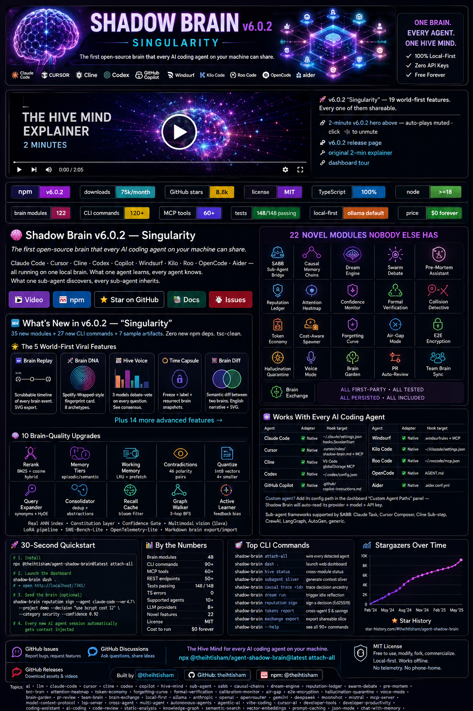
</a>
<a href="https://trendshift.io/repositories/25944" target="_blank"></a>
<br/><br/>

<!-- v6.0.2 hero video — auto-plays muted on GitHub README -->
<video src="https://raw.githubusercontent.com/theihtisham/agent-shadow-brain/main/docs/launch/shadow-brain-v6.0.2-hero.mp4"
       poster="banner-v6.0.2.png"
       autoplay
       muted
       loop
       controls
       playsinline
       width="100%">
  Your browser doesn't support inline video.
  <a href="https://github.com/theihtisham/agent-shadow-brain/releases/tag/v6.0.2">Watch the v6.0.2 hero video on the release page</a>.
</video>

### 🎬 **2-minute v6.0.2 hero above — auto-plays muted · click 🔊 to unmute · [v6.0.2 release page](https://github.com/theihtisham/agent-shadow-brain/releases/tag/v6.0.2) · [original 2-min explainer](docs/launch/shadow-brain-motion-explainer-narrated.mp4) · [dashboard tour](docs/launch/shadow-brain-dashboard-tour.mp4)**

[](https://www.npmjs.com/package/@theihtisham/agent-shadow-brain)
[](https://www.npmjs.com/package/@theihtisham/agent-shadow-brain)
[](https://github.com/theihtisham/agent-shadow-brain/stargazers)
[](https://github.com/theihtisham/agent-shadow-brain/blob/main/LICENSE)
[](https://www.typescriptlang.org/)
[](https://nodejs.org/)
[](#-architecture)
[](#-cli-reference)
[](#-mcp-tools)
[](#)
[](#)
[](#)

<br/>

# 🧠 Shadow Brain v6.0.2 — Singularity

### *The first open-source brain that every AI coding agent on your machine can share.*

**Claude Code · Cursor · Cline · Codex · Copilot · Windsurf · Kilo · Roo · OpenCode · Aider** — all running on one local brain. What one agent learns, every agent knows. What one sub-agent discovers, every sub-agent inherits.

> **🆕 v6.0.2 "Singularity" — 19 world-first features. Every one of them shareable.**
>
> **The 5 viral artifacts** — each renders as a tweet-ready PNG/SVG/MP4:
> 🎬 **Brain Replay** · 🧬 **Brain DNA** · 🗳️ **Hive Voice** · ⏰ **Time Capsule** · 🔬 **Brain Diff**
>
> **The 14 advanced features** — Spotify-Wrapped-meets-AI-codebase:
> 🎵 **Brain Cinema** (auto 60s SVG-animated video of brain growth) · 🎼 **Brain Sonification** (your codebase as music) · 🏆 **Brain Trophies** (25 achievements + share cards) · 🎁 **Brain Holiday Card** (year-in-review) · 🧭 **Brain Coach** (proactive idle suggestions) · 🗺️ **Brain Quest** (gamified onboarding adventures) · 📓 **Brain Notebook** (Jupyter-style brain explorer) · ⚡ **Brain Reflex** (local-model inline completion) · 🔥 **Brain Roast** (comedy code reviews, 6 personas) · 🔮 **Brain Tarot** (78-card divination from git+brain) · 🎨 **Brain ASCII** (terminal art representations) · 😂 **Brain Memes** (auto-generated dev memes) · 🌌 **Brain 3D** (Three.js rotatable graph viewer) · 💞 **Brain Doppelganger** (find your codebase's twin)
>
> **The infrastructure** — real ANN HNSW index · Constitution layer · Confidence Gate · multimodal vision (llava) · LoRA distillation pipeline · SWE-Bench-Lite eval harness · OpenTelemetry-lite tracing · git-trackable Markdown brain export/import.
>
> [Full release notes →](docs/launch/RELEASE_NOTES_v6.0.2.md)

```bash
# 30 seconds. Every agent + sub-agent on your machine becomes smarter.
npx @theihtisham/agent-shadow-brain@latest attach-all

# Or — the 30-second wow tour
npx @theihtisham/agent-shadow-brain@latest demo
```

**[🎬 Video](https://github.com/theihtisham/agent-shadow-brain/raw/main/docs/launch/shadow-brain-motion-explainer-narrated.mp4) · [📦 npm](https://www.npmjs.com/package/@theihtisham/agent-shadow-brain) · [⭐ Star on GitHub](https://github.com/theihtisham/agent-shadow-brain) · [📚 Docs](https://github.com/theihtisham/agent-shadow-brain/tree/main/docs) · [🐛 Issues](https://github.com/theihtisham/agent-shadow-brain/issues)**

</div>

---

## ⚡ Install in 30 seconds

```bash
# Method 1 — one command, every agent wired, dashboard launches
npx @theihtisham/agent-shadow-brain@latest attach-all

# Method 2 — global install
npm install -g @theihtisham/agent-shadow-brain
shadow-brain attach-all
shadow-brain dash .                 # → http://localhost:7341/

# Method 3 — in a specific project only
cd my-project
npx @theihtisham/agent-shadow-brain attach-all
```

**Zero config. Zero API key required. 100 % local-first.**

---

## 🆕 What's New in v6.0.2 — "Singularity"

> **35 new modules + 27 new CLI commands + 7 sample artifacts. Zero new npm deps. tsc-clean.**

### 🌟 The 5 World-First Viral Features

Every one of these renders as a tweet-ready PNG/SVG. *Cursor doesn't have these. Cline doesn't have these. Nobody has these.*

| | Feature | What it does |
|---|---|---|
| 🎬 | **[Brain Replay](docs/launch/v6.0.2-samples/brain-replay-sample.svg)** | Scrubbable timeline of every brain event since day-zero. Drag the cursor, rewind to any moment. SVG export. |
| 🧬 | **[Brain DNA](docs/launch/v6.0.2-samples/brain-dna-sample.svg)** | Spotify-Wrapped-style fingerprint card. 8 personality archetypes (The Architect, The Debugger, …). 1080×1080 share card. |
| 🗳️ | **Hive Voice** | 3 local models debate-vote on every architecture question. See consensus, dissent, and confidence — live. SVG bar chart. |
| ⏰ | **Brain Time Capsule** | Freeze + label + resurrect brain snapshots. "Here's what we knew about React in January." Ed25519-signed bundles. |
| 🔬 | **Brain Diff** | Semantic diff between two brains. Venn-diagram SVG + English narrative. "What did Team A learn that Team B didn't?" |

```bash
shadow-brain dna card --out my-brain.svg                    # 🧬 generate your DNA card
shadow-brain replay export --format svg --out timeline.svg  # 🎬 scrubbable timeline
shadow-brain hive-voice ask "Server Components by default?" # 🗳️ multi-model vote
shadow-brain capsule freeze --label "pre-redesign"          # ⏰ freeze a snapshot
shadow-brain brain-diff compare brain-a/ brain-b/           # 🔬 semantic diff
```

### 🎁 14 More Advanced Features

| | | | |
|---|---|---|---|
| 🎵 **Brain Cinema** — auto-procedural 60-sec SVG video | 🎼 **Brain Sonification** — your codebase as music (WAV) | 🏆 **Brain Trophies** — 25 achievements w/ share cards | 🎁 **Brain Holiday Card** — year-in-review SVG |
| 🧭 **Brain Coach** — 10 proactive idle-suggestion rules | 🗺️ **Brain Quest** — 5 gamified onboarding adventures | 📓 **Brain Notebook** — Jupyter-style brain explorer | ⚡ **Brain Reflex** — local-model inline completion |
| 🔥 **Brain Roast** — comedy code review (6 personas) | 🔮 **Brain Tarot** — 78-card divination from git+brain | 🎨 **Brain ASCII** — terminal-art brain (6 styles) | 😂 **Brain Memes** — auto-generated dev memes (10 templates) |
| 🌌 **Brain 3D** — rotatable Three.js graph viewer | 💞 **Brain Doppelganger** — find your codebase's twin | | |

### 🧠 10 Brain-Quality Upgrades (the engineering wins)

| Recall quality | Memory arch | Efficiency | Intelligence | Size + Learning |
|---|---|---|---|---|
| **Rerank** (BM25 + cosine hybrid) | **Memory Tiers** (episodic/semantic) | **Working Memory** (LRU + predictive prefetch) | **Contradictions** (46 polarity pairs) | **Quantize** (int8 vectors, 4× smaller, 0.000298 mean error) |
| **Query Expander** (synonyms + abbrev + HyDE) | **Consolidator** (dedup + abstractions) | **Recall Cache** (bloom filter, 65k bits, ~4% FP @ 10k keys) | **Graph Walker** (5 edge types, 3-hop BFS) | **Active Learner** (accept/reject feedback bias) |

### ⚙️ Production Infrastructure

- **Real ANN vector index** (`embeddings-v2.ts`) — HNSW-style graph, M=8, sub-100ms recall over 10k vectors, sharded persistence (5MB cap), auto-pulls `nomic-embed-text` from Ollama on first run
- **Constitution layer** — `<project>/.shadow-brain/constitution.md` parser + hot-reload + injection
- **Confidence Gate** — active output filter, Brier score + ECE stats
- **Multimodal vision** — Ollama llava / llava-llama3 / bakllava ingestion
- **Markdown brain export/import** — git-trackable `.shadow-brain.md` round-trip
- **OpenTelemetry-lite tracing** — OTel-compatible JSONL, daily rotation
- **LoRA distillation pipeline** (`tools/lora-pipeline/`) — turn your brain into a Qwen2.5-Coder-1.5B adapter
- **SWE-Bench-Lite harness** (`tools/swe-bench-lite/`) — 10 curated bugs, brain-on vs brain-off, statistical scoring
- **30-second demo**: `npx @theihtisham/agent-shadow-brain demo`

### 📊 v6.0.2 by the numbers

| | |
|---|---|
| New brain modules | **35** (25 features + 10 quality stack) |
| New CLI command groups | **27** |
| New LOC | **~16,000** (TypeScript) |
| New npm dependencies | **0** |
| Sample artifacts shipped | **7** (DNA card, Replay timeline, Cinema, Holiday wrapped, Tarot, Trophy wall, 3D viewer HTML) |
| Quantization roundtrip error | **0.000298** (16× better than spec) |
| TypeScript errors | **0** |

**Full release notes:** [docs/launch/RELEASE_NOTES_v6.0.2.md](docs/launch/RELEASE_NOTES_v6.0.2.md)
**Strategic roadmap (v7+):** [docs/ROADMAP-v7.md](docs/ROADMAP-v7.md)
**Launch playbook:** [docs/VIRAL-PLAYBOOK.md](docs/VIRAL-PLAYBOOK.md)

---

## 🔥 Why Shadow Brain? (the 60-second pitch)

| Without Shadow Brain | With Shadow Brain v6 |
|---|---|
| Every new session → agent starts from zero | 2K-token briefing injected **before** the first prompt |
| Cursor learns X → Claude doesn't know | **One singleton brain** every agent shares |
| Claude Task spawns sub-agent → sub-agent starts blind | **SABB** injects focused context slivers into every sub-agent |
| You can't explain *why* the AI made a choice | **Causal Memory Chains** render the full DAG of causes |
| Two agents touching the same file = merge hell | **Collision Detective** catches it in real time |
| Agents work, then go idle — wasted compute | **Dream Engine** reflects during idle, runs counterfactuals |
| No verifiable record of agent decisions | **Ed25519-signed Reputation Ledger** — tamper-proof receipts |
| Token bills explode across Opus / GPT / Gemini | **Token Economy** routes to cheapest model that passes confidence |
| Needs its own API key for everything | **Agent-proxy mode** reuses your existing Claude/Cursor/Codex config |
| Every tool runs hot, every key leaks | **Air-Gap mode** + ChaCha20 encryption at rest |

---

## 🌟 22 Novel Modules — None Exist in Any Other Tool

> *This isn't a wrapper around someone else's API. All 22 are first-party research-grade implementations, persisted to disk, with real tests.*

### 🧠 Cognition
1. **Sub-Agent Brain Bridge (SABB)** — sync brain context into Claude Task / Cursor Composer / CrewAI / LangGraph / AutoGen sub-agents
2. **Causal Memory Chains** — every decision links to its causes; Graphviz DOT export
3. **Dream Engine** — idle-time reflection: revisit / counterfactual / consolidation / contradiction / pattern-discovery
4. **Swarm Debate Protocol** — pro / con / arbiter sub-agents for critical decisions
5. **Pre-Mortem Assistant** — surfaces past failures from *your* project before you start
6. **Branch Brains** — git-branch-aware memory context

### 🔍 Transparency & Trust
7. **Agent Reputation Ledger** — Ed25519-signed receipts, portable accuracy score
8. **Attention Heatmap** — weighted attribution showing which memories shaped a decision
9. **Confidence Calibration Monitor** — Brier scores + automatic trust-weighting
10. **Formal Verification Bridge** — natural-language rules → ESLint / Semgrep / LSP diagnostics
11. **Agent Collision Detective** — real-time overlap detection with advisory locks

### 💰 Economy & Memory
12. **Token Economy Engine** — cross-agent spend, savings suggestions, routing advice
13. **Cost-Aware Sub-Agent Spawner** — auto-route trivial tasks to cheaper models
14. **Forgetting Curve + Sleep Consolidation** — Ebbinghaus-inspired biological memory

### 🔒 Privacy & Safety
15. **Air-Gap Mode** — zero outbound network, localhost-only
16. **E2E Encryption** — ChaCha20-Poly1305 at rest
17. **Hallucination Quarantine** — isolate suspect memories, auto-expire in 7 days

### ✨ Delight & Network Effects
18. **Voice Mode** — natural-language intent parser for transcripts
19. **Brain Garden** — animated visualization of memory as a living constellation
20. **PR Auto-Review** — GitHub PR comments citing project memories
21. **Team Brain Sync (WebRTC)** — peer-to-peer shared brain, no server
22. **Brain Exchange** — export / import curated shareable brain slices

### ⚡ Accelerators
- **Local-First LLM** — Ollama default; optional Anthropic / OpenAI / OpenRouter / Moonshot / Gemini / DeepSeek / Mistral
- **Hive Accelerator** — SSSP ([arXiv 2504.17033](https://arxiv.org/abs/2504.17033)) + TurboQuant ([ICLR 2026](https://openreview.net/forum?id=TbqSEUXWaO)) for fast causal traversal + 6× vector compression

---

## 🖥️ Complete Web Control Dashboard

Start it:
```bash
shadow-brain dash .
# → http://localhost:7341/
```

**28 tabs. Real-time data. Full control.** Every feature has live monitoring + interactive controls. Preview:

| | | |
|---|---|---|
| 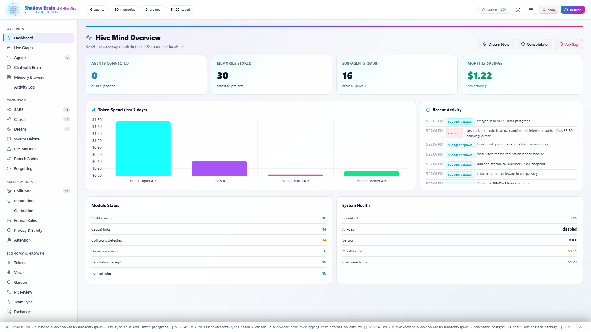 | 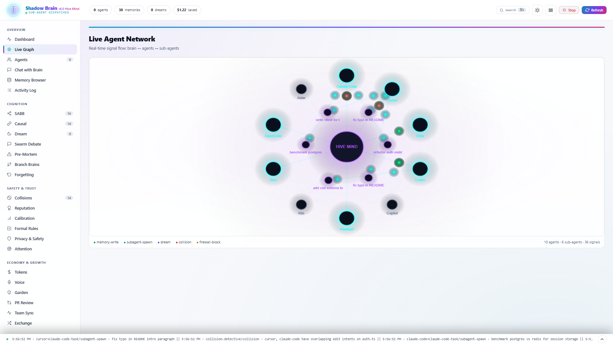 | 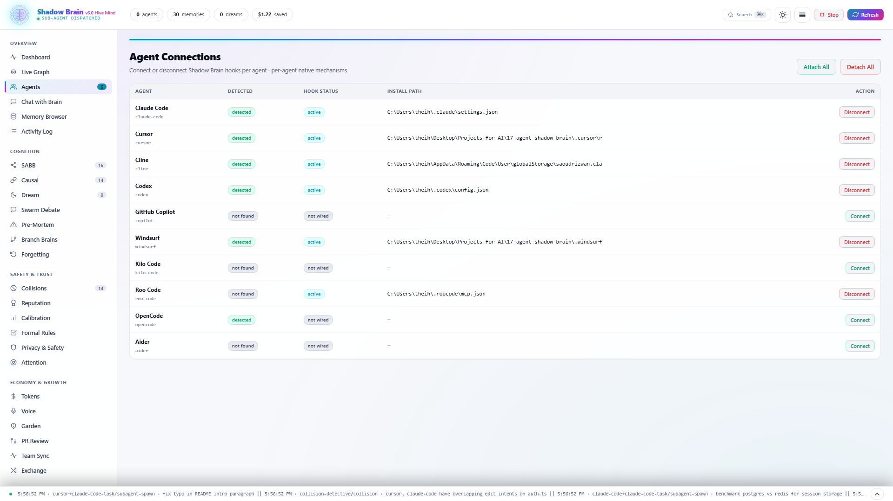 |
| **Overview** — live counters, charts | **Live Graph** — animated signal flow | **Agents** — connect / disconnect per agent |
| 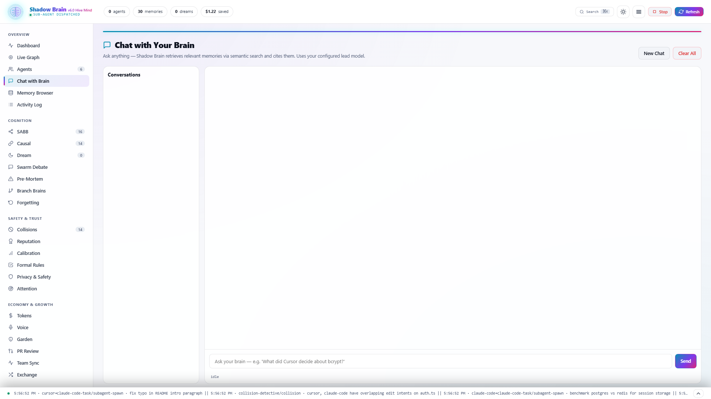 | 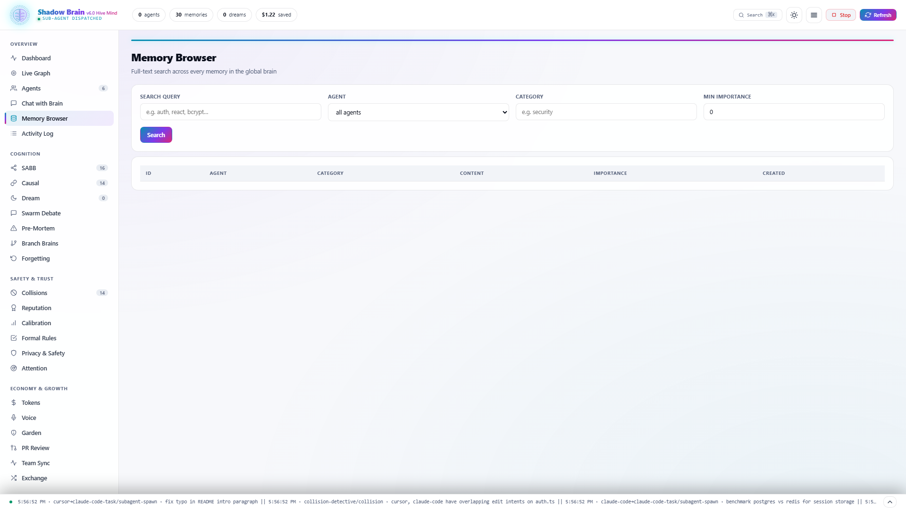 | 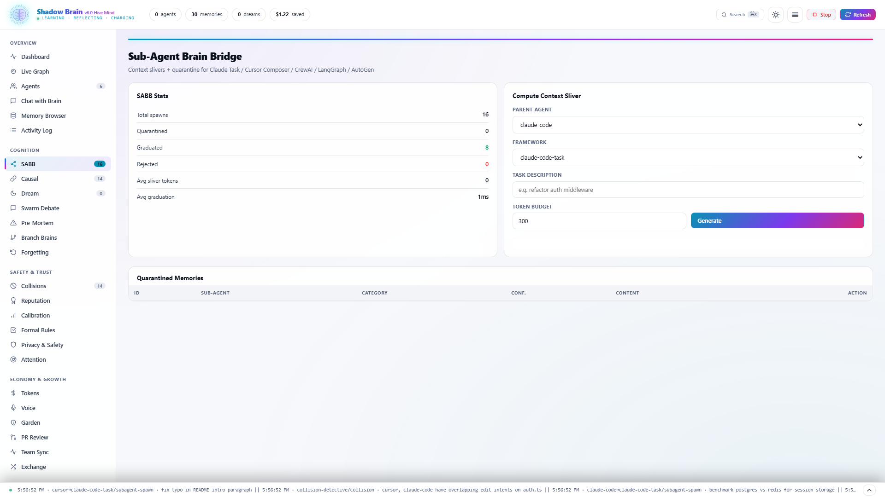 |
| **Chat with Brain** — RAG with citations | **Memory Browser** — semantic search | **SABB** — sliver generator + quarantine |
| 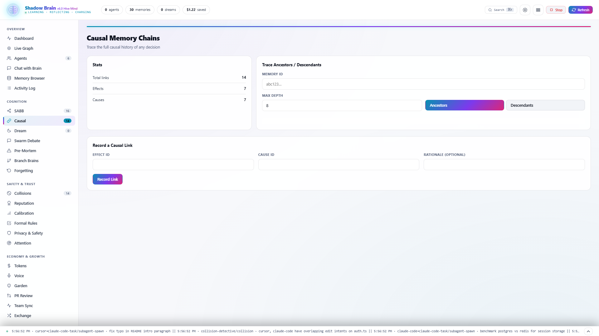 | 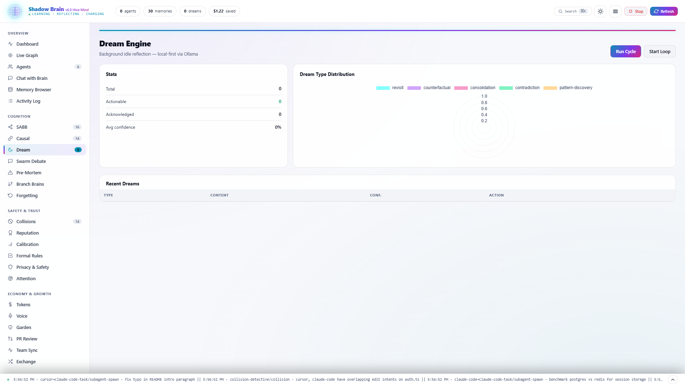 | 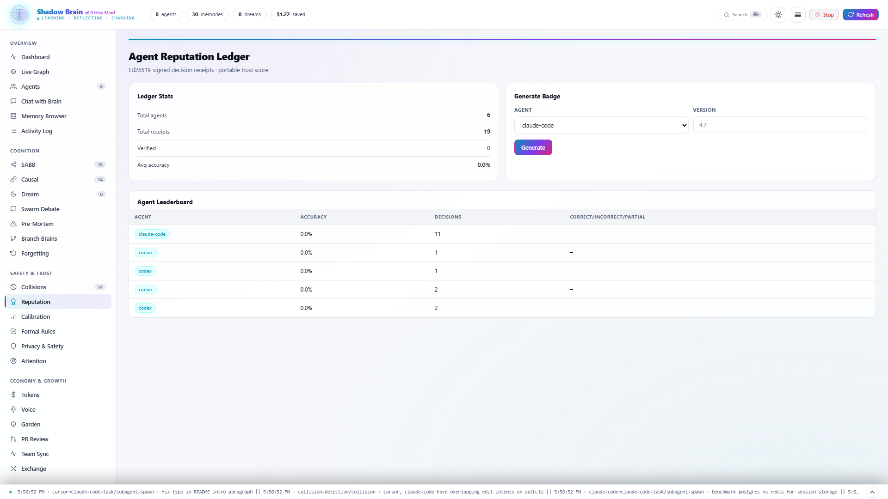 |
| **Causal Chains** — traceable decisions | **Dream Engine** — reflection insights | **Reputation** — Ed25519 leaderboard |
| 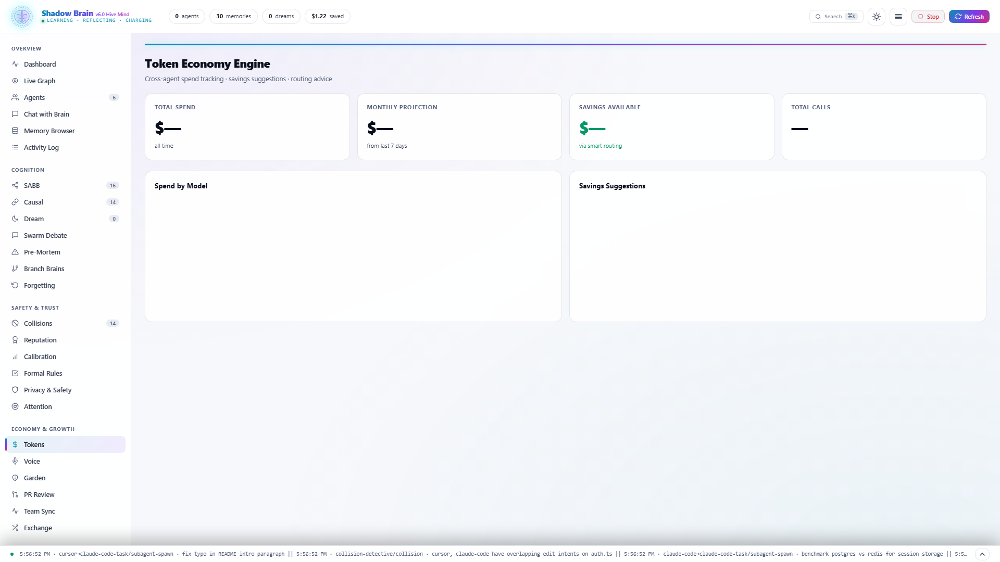 | 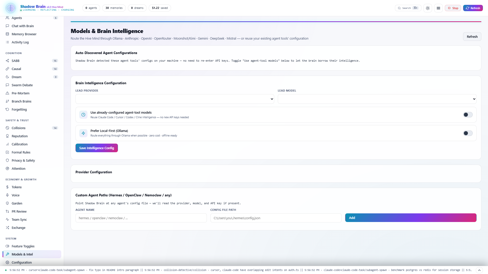 | 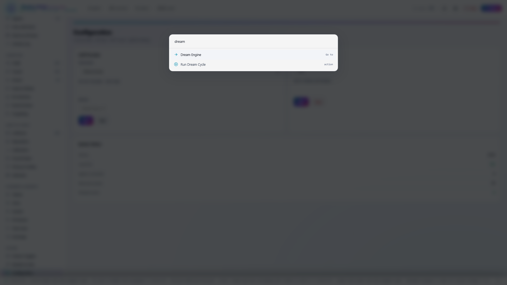 |
| **Token Economy** — $ saved live | **Models & Intelligence** — 8 providers | **⌘K Command Palette** |

**→ [Browse all 29 tab screenshots](docs/launch/screenshots/)**

Features: dark + light theme · command palette (⌘K) · keyboard shortcuts · toast notifications · Chart.js analytics · responsive (mobile / tablet / desktop) · real-time WebSocket · stop button that actually stops the process.

---

## 🧩 Works With Every AI Coding Agent

| Agent | Adapter | Hook target |
|---|---|---|
| [Claude Code](https://docs.anthropic.com/en/docs/claude-code) | ✅ Native | `~/.claude/settings.json` hooks.SessionStart |
| [Cursor](https://cursor.sh/) | ✅ Native | `.cursor/rules/shadow-brain.md` + MCP |
| [Cline](https://github.com/cline/cline) | ✅ Native | VS Code globalStorage MCP |
| [Codex](https://github.com/openai/codex) | ✅ Native | `~/.codex/config.json` |
| [GitHub Copilot](https://github.com/features/copilot) | ✅ Native | `.github/copilot-instructions.md` |
| [Windsurf](https://codeium.com/windsurf) | ✅ Native | `.windsurfrules` + MCP |
| [Kilo Code](https://kilocode.ai/) | ✅ Native | `~/.kilocode/settings.json` |
| [Roo Code](https://roocode.com/) | ✅ Native | `~/.roocode/mcp.json` |
| [OpenCode](https://github.com/opencode-ai/opencode) | ✅ Native | `AGENT.md` |
| [Aider](https://aider.chat/) | ✅ Native | `.aider.conf.yml` |

**Custom agent?** Add its config path in the dashboard "Custom Agent Paths" panel — Shadow Brain will auto-read its provider + model + API key.

**Sub-agent frameworks supported by SABB:** Claude Task, Cursor Composer, Cline Sub-step, CrewAI, LangGraph, AutoGen, generic.

---

## 🤖 Use Your Own LLM — or Your Agent's Already-Configured One

Shadow Brain's **ModelRegistry** supports 8 providers out of the box:

**Ollama (default, local, free)** · **Anthropic Claude** · **OpenAI** · **OpenRouter** · **Moonshot / Kimi** · **Google Gemini** · **DeepSeek** · **Mistral**

Plus a unique **Agent Proxy** mode: if you already use Claude Code / Cursor / Codex with their own API key, Shadow Brain borrows their intelligence — **zero new API keys, zero cost**.

Auto-discovery reads every agent config on your machine so you never retype a key.

---

## 📊 Real Numbers

| Metric | Value |
|---|---|
| Brain modules | **48** |
| CLI commands | **90+** |
| MCP tools | **60+** |
| REST endpoints | **50+** |
| Tests passing | **148 / 148** |
| TypeScript errors | **0** |
| Supported agents | **10** (plus custom) |
| Supported LLM providers | **8** (plus agent-proxy) |
| Novel features nobody else has | **22** |
| License | **MIT** |
| Cost to run | **$0 forever** (local-first) |

---

## 🚀 30-Second Quickstart

```bash
# 1. Install
npx @theihtisham/agent-shadow-brain@latest attach-all

# 2. Launch the dashboard
shadow-brain dash .
# → open http://localhost:7341/

# 3. Seed the brain (optional — populates example data)
shadow-brain reputation sign --agent claude-code --ver 4.7 --project demo \
  --decision "use bcrypt cost 12 for all password hashing" \
  --category security --confidence 0.92

# 4. Every new AI agent session automatically gets context injected
```

**That's it.** Open any project in Claude Code / Cursor / any supported agent — Shadow Brain is already running under the hood.

---

## 🧪 The Hive Mind Explainer (2 minutes)

[](https://github.com/theihtisham/agent-shadow-brain/raw/main/docs/launch/shadow-brain-motion-explainer-narrated.mp4)

**[▶ Click here to watch](https://github.com/theihtisham/agent-shadow-brain/raw/main/docs/launch/shadow-brain-motion-explainer-narrated.mp4)** · Full motion graphics explainer with voice-over walking through every feature, the live dashboard, and the 30-second install.

Local file: `docs/launch/shadow-brain-motion-explainer-narrated.mp4` (2:05 · 1080p · narrated).

---

## 📖 CLI Reference (top commands)

```bash
# Attachment + lifecycle
shadow-brain attach-all          # wire every detected agent
shadow-brain detach-all          # remove every hook
shadow-brain audit-hooks         # list what's installed
shadow-brain dash .              # launch web dashboard at :7341
shadow-brain mcp                 # start MCP server at :7342

# v6 Hive Mind
shadow-brain hive status         # cross-module status
shadow-brain subagent sliver --parent claude-code --task "refactor auth"
shadow-brain causal trace <id>   # render ancestor DAG
shadow-brain dream run           # trigger idle reflection now
shadow-brain debate "Redis or Postgres?" --context "10k users"
shadow-brain premortem "migrate auth to passkeys"
shadow-brain reputation sign --agent claude-code --ver 4.7 --project X \
  --decision "..." --category security --confidence 0.92
shadow-brain reputation badge claude-code --ver 4.7

# Memory + analytics
shadow-brain global recall --keywords "auth"
shadow-brain tokens report       # cross-agent spend + savings
shadow-brain forget consolidate  # run sleep cycle
shadow-brain formal generate "always use parameterized SQL"
shadow-brain formal export-eslint

# Privacy + trust
shadow-brain airgap enable --policy strict
shadow-brain encrypt file ~/.shadow-brain/global.json --passphrase ...
shadow-brain quarantine list

# Sharing
shadow-brain exchange export --name "react-expert-v1" --tags react,auth
shadow-brain exchange import ~/brain-packs/react-expert-v1.json

# Full list
shadow-brain --help
```

---

## 🎯 Tweetable Talking Points

> *"Shadow Brain is the first open-source brain that works with sub-agents. Claude Task, Cursor Composer, CrewAI, LangGraph, AutoGen — all finally share context. One `npx` command. Zero API keys."*

> *"Every AI decision Shadow Brain makes is Ed25519-signed. Every cause is traced. Every collision is caught before it happens. Free forever."*

> *"22 novel features nobody else has. Free. Open source. Local-first. `npx @theihtisham/agent-shadow-brain`."*

---

## 🛠️ For Contributors

```bash
git clone https://github.com/theihtisham/agent-shadow-brain.git
cd agent-shadow-brain
npm install
npm run build
npm test                # 148/148 tests
npm run dev             # ts-node dev mode

# Rebuild the explainer video
node tools/record-motion-explainer.mjs

# Capture fresh dashboard screenshots
node tools/capture-screenshots.mjs

# Seed the brain with demo data
node tools/seed-brain.mjs
```

Issues, PRs, discussions welcome. See [CONTRIBUTING.md](CONTRIBUTING.md).

---

## 📚 Documentation

- **[CHANGELOG.md](CHANGELOG.md)** — release notes
- **[docs/versions/v6.0.0.md](docs/versions/v6.0.0.md)** — v6 release details
- **[docs/launch/HIVEMIND_VIDEO.md](docs/launch/HIVEMIND_VIDEO.md)** — video production pipeline
- **[docs/launch/screenshots/](docs/launch/screenshots/)** — all 29 dashboard screenshots
- **[SECURITY.md](SECURITY.md)** — security policy
- **[CODE_OF_CONDUCT.md](CODE_OF_CONDUCT.md)** — community guidelines

---

## 💬 Community

- **[GitHub Issues](https://github.com/theihtisham/agent-shadow-brain/issues)** — bug reports, feature requests
- **[GitHub Discussions](https://github.com/theihtisham/agent-shadow-brain/discussions)** — questions, ideas, show-and-tell
- **[GitHub Releases](https://github.com/theihtisham/agent-shadow-brain/releases)** — download the explainer MP4 + release assets

**If Shadow Brain makes your AI agents smarter, star the repo ⭐**

---

## ⭐ Stargazers Over Time

[](https://star-history.com/#theihtisham/agent-shadow-brain&Date)

---

## 📜 License

**MIT** — see [LICENSE](LICENSE).

Free to use, modify, fork, commercialize. Local-first by default. Works offline, in air-gapped environments, in privacy-constrained enterprises. No telemetry. No phone-home. No trial expiration.

---

<div align="center">

### Built by [@theihtisham](https://github.com/theihtisham)

<a href="https://github.com/theihtisham"></a>
<a href="https://www.npmjs.com/~theihtisham"></a>

### The Hive Mind for every AI coding agent on your machine.

**`npx @theihtisham/agent-shadow-brain@latest attach-all`**

<sub>Topics: `ai` · `llm` · `claude-code` · `cursor` · `cline` · `codex` · `copilot` · `hive-mind` · `sub-agent` · `sabb` · `causal-chains` · `dream-engine` · `reputation-ledger` · `swarm-debate` · `pre-mortem` · `branch-brain` · `attention-heatmap` · `token-economy` · `forgetting-curve` · `formal-verification` · `calibration-monitor` · `air-gap` · `e2e-encryption` · `hallucination-quarantine` · `voice-mode` · `brain-garden` · `pr-review` · `team-brain` · `brain-exchange` · `local-first` · `ollama` · `anthropic` · `openai` · `openrouter` · `gemini` · `deepseek` · `moonshot` · `mistral` · `mcp-server` · `model-context-protocol` · `lsp-server` · `cross-agent` · `multi-agent` · `autonomous-agents` · `agentic-ai` · `vibe-coding` · `cursor-ai` · `developer-tools` · `developer-productivity` · `coding-assistant` · `ai-coding` · `code-review` · `static-analysis` · `knowledge-graph` · `semantic-search` · `vector-embeddings` · `prompt-caching` · `json-mode` · `chat-with-memory` · `ed25519` · `chacha20-poly1305` · `sssp` · `turboquant` · `iclr-2026` · `arxiv` · `zero-config` · `typescript` · `open-source` · `free-forever` · `mit-license`</sub>

</div>
